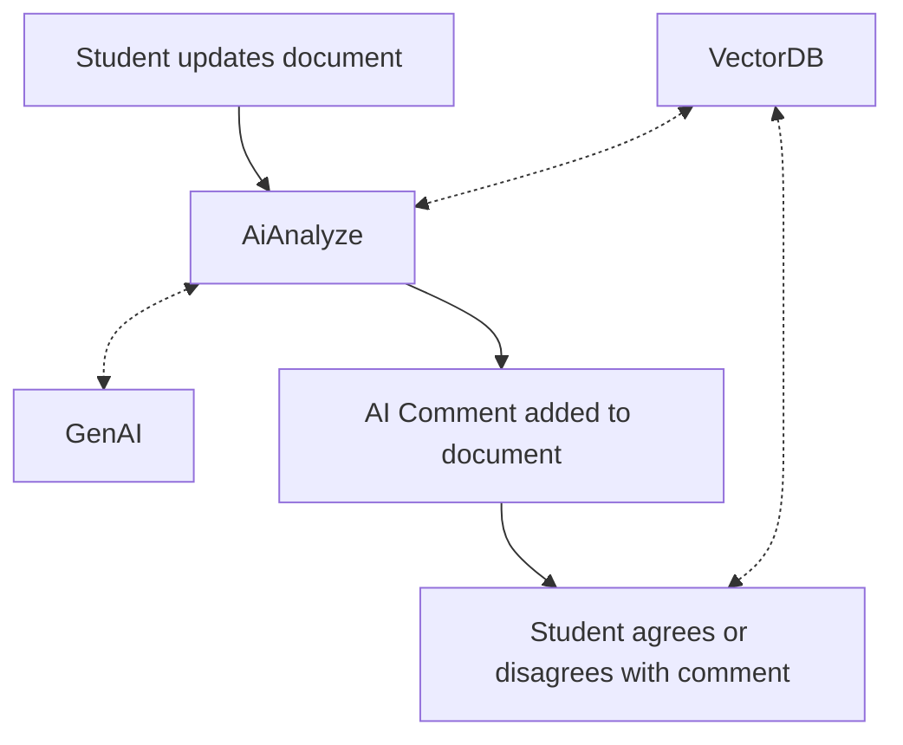
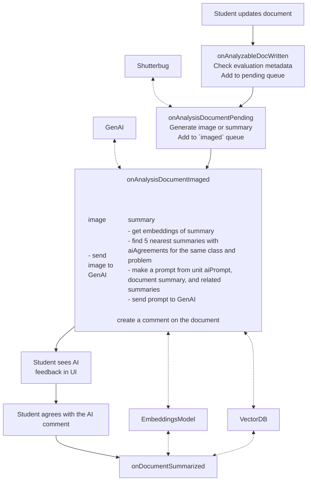
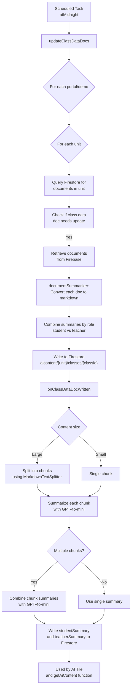
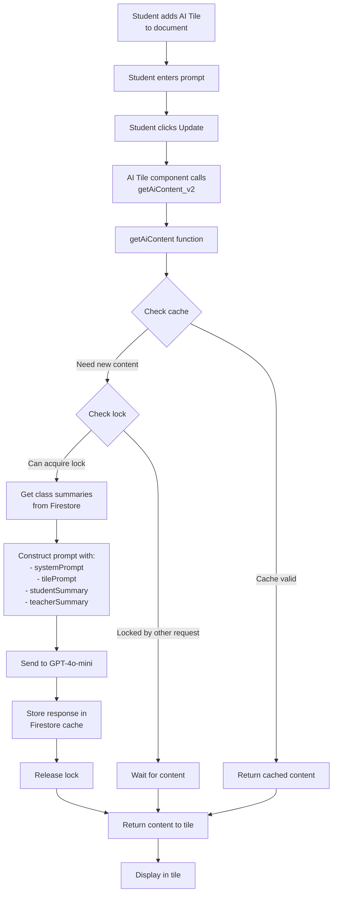
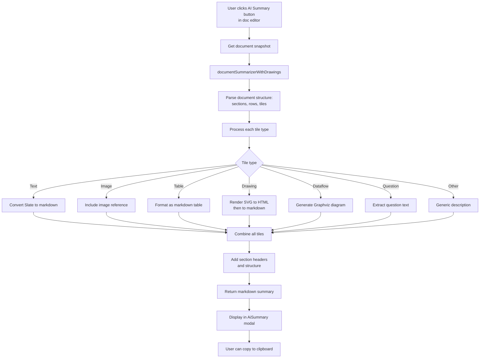

# AI Features

This document describes the AI-powered features in the Collaborative Learning Application using Environment (CLUE) codebase. The system uses OpenAI's GPT-4o-mini model to analyze student work, generate summaries, and provide intelligent content assistance.

## Overview

The AI features in CLUE include:

1. **AI Document Analysis** - Automated categorization and feedback on student documents with vector-based similarity search
2. **Class Summary Generation** - Daily summaries of student and teacher work in each class
3. **AI Tile** - Dynamic AI-generated content tiles that can be embedded in documents
4. **Standalone AI Summary** - Text summarization tool available in the document editor

## 1. AI Document Analysis

### Purpose
Automatically analyzes student documents, categorizes them based on custom criteria, and posts feedback as comments on the documents. Maintains searchable document summaries with vector embeddings to enable similarity search for more consistent categorizations across related student work.

### User + AI Flow


### Implementation Flow



### `onAnalyzableDocWritten` (Firebase Func)
Monitors Firebase Realtime Database for documents with `evaluation/{evaluator}` metadata. When detected, adds a `AnalysisQueueDocument` to the Firestore `pending` queue.

- Watches paths like: `{realm}/{realmId}/portals/{portalId}/classes/{classId}/users/{userId}/documentMetadata/{docId}/evaluation/{evaluator}`
- The incoming objects include a `timestamp` and an optional `aiPrompt` field with:
  - mainPrompt
  - categorizationDescription (optional)
  - categories (optional)
  - keyIndicatorsPrompt (optional)
  - discussionPrompt (optional)
  - systemPrompt
  - summarizer (optional)
- The output objects include:
  - The `aiPrompt` object from the input
  - Paths needed to identify the document
  - The `evaluator` key from the incoming path could be "categorize-design", "custom", or "mock"

### `onAnalysisDocumentPending` (Firebase Func)
Monitors the `pending` queue and processes documents based on their `summarizer` property

- Gets the actual CLUE document content
- Determines the summarizer from aiPrompt, otherwise is image unless the unit is "cas"
- **Image summarizer**:
  - Generates HTML with the document content embedded
  - sends to Shutterbug service to create a screenshot and waits for a response
  - write a copy of the input `AnalysisQueueDocument` doc to `imaged` queue with a new `docimageUrl` property.
- **Text summarizer**:
  - Uses `documentSummarizer` to create a markdown text representation of the document
  - writes a copy of the input `AnalysisQueueDocument` doc to `imaged` queue with a new `docSummary` property.
- Input doc is removed from the `pending` queue.

### `onAnalysisDocumentImaged` (Firebase Func)
Sends screenshots or text summaries to OpenAI for analysis

- Calls `categorizeUrl()` for image-based analysis with the screenshot URL
- Calls `categorizeSummary()` for text-based analysis with the markdown summary
- Uses custom AI prompts from unit configuration or defaults
- Creates a comment on the original document with the AI's categorization and feedback
- Input doc is removed from the `imaged` queue

### `onDocumentSummarized` (Firebase Func)
Watches for student responses to Ada's comments (comments with `agreeWithAi` field)

- Retrieves document content and generates text summary
- Creates vector embedding using OpenAI embeddings API
- Stores summary in Firestore `summaries` collection for similarity search
- Manages AI agreements object and deletion of summaries when comments are removed
- **Current limitation**: Only processes documents in the "cas" unit

### Configuration

Evaluator types are configured in unit settings:
- **"evaluator"**: Standard AI evaluation
- **"custom"**: Custom evaluation with user-defined prompts
- **"cas"**: Defaults to text summarizer
- Summarizer type: `"image"` (default) or `"text"`

### AI Agreements and Student Feedback

When AI Document Analysis evaluates a student document, it posts a comment as **"Ada Insight"** (an AI user). Students can then respond to Ada's feedback by creating a comment that indicates whether they:
- **Agree** with Ada's categorization
- **Disagree** with Ada's categorization
- Are **not sure** about Ada's categorization

These responses are called "AI agreements" and are stored in the `agreeWithAi` field of the comment.

### Authoring

In the CLUE authoring app the author can enable the "AI Tile". This adds this special tile to the CLUE toolbar while authoring sections in the authoring app.

The author can also author the global AI settings for the unit. This includes all of the prompts in the `aiPrompt` object.

## 2. Class Summary Generation

### Purpose
Creates and maintains AI-generated summaries of all student and teacher work in each class and unit, updated daily.

### Data Flow



### Key Components

#### Scheduled Task
- **`atMidnight`** - Runs daily at 7am UTC (midnight PDT)
  - Calls `updateClassDataDocs()` to refresh class summaries
  - Also cleans up old Firebase roots

#### Data Collection (`update-class-data-docs.ts`)
- Scans specified portals and units (currently: "learn.concord.org" portal, "AITEST" demo, "qa-config-subtabs" and "mods" units)
- Queries Firestore to find all documents in each class/unit
- Retrieves raw document content from Firebase Realtime Database
- Uses `documentSummarizer` to convert each document to markdown
- Separates teacher documents from student documents
- Writes combined content to Firestore at `{realm}/{realmId}/aicontent/{unit}/classes/{classId}`

#### AI Summarization (`on-class-data-doc-written.ts`)
When class data doc is written:
1. Splits large content into chunks (max 64,000 characters per chunk)
2. Sends each chunk to GPT-4o-mini for summarization
3. If multiple chunks, combines the summaries into a final summary
4. Writes separate `studentSummary` and `teacherSummary` fields
5. These summaries are used as context for the AI Tile

#### Manual Trigger
- **`generateClassData`** - Callable function that can be invoked from the client to immediately update a specific class's data doc
  - Used by the "AI Summary" button in the navigation UI
  - Bypasses the daily scheduled task for development/testing

## 3. AI Tile

### Purpose
A tile type that can be added to student documents to display dynamically generated AI content based on a custom prompt.

### How It Works

The AI Tile consists of:
- **Prompt field** (editable by students): Where students enter their question or request
- **Response area** (read-only): Displays the AI-generated content
- **Update button**: Regenerates the content with the current prompt

### Data Flow



### Key Components

#### Client-Side (`ai-tile.tsx`, `ai-content.ts`)
- **AIContentModel**: MobX State Tree model storing `prompt` and `text`
- **AIComponent**: React component rendering the tile
  - Monitors `prompt` changes and update requests
  - Calls `getAiContent_v2` Firebase function
  - Displays loading state during generation

#### Server-Side (`get-ai-content.ts`)
- **`getAiContent`** - Callable Firebase function
  - Implements caching: returns cached content if prompt and class summaries haven't changed
  - Uses distributed locking to prevent concurrent generation for the same tile
  - Retrieves `studentSummary` and `teacherSummary` from class info doc
  - Constructs messages with system prompt, tile prompt, and class context
  - Calls GPT-4o-mini with combined context
  - Stores result in Firestore at `{realm}/{realmId}/aicontent/{unit}/classes/{classId}/documents/{documentId}/tiles/{tileId}`

### Usage
The AI Tile uses the class summaries generated by the daily task to provide relevant, context-aware responses. For example:
- A student asks "What are the main themes we're exploring?"
- The AI uses the student and teacher summary context to answer based on actual class work

**Note**: The AI Tile is only functional when students are in a class context (has `classHash`). It is not available in authoring mode.

## Questions

How does the AI system automatically decide when to show exemplars?

## 4. Standalone AI Summary

### Purpose
Provides a quick text summary of any document in the standalone document editor, useful for development, testing, and document review.

### How It Works

Available in the standalone document editor (`doc-editor-app.tsx`):
1. User clicks "AI Summary" button
2. System uses `documentSummarizerWithDrawings` to convert current document to markdown
3. Displays summary in a modal dialog
4. User can copy summary to clipboard

### Data Flow



### Key Components

#### Document Summarizer (`ai-summarizer.ts`)
Core summarization logic shared across multiple features:
- **`documentSummarizer()`**: Main entry point
  1. Parses document content JSON
  2. Normalizes structure (sections → rows → tiles)
  3. Processes each tile with type-specific handlers
  4. Assembles markdown output

- **Tile Handlers**: Convert each tile type to markdown
  - Text tiles: Use `slateToMarkdown` to convert Slate editor format
  - Image tiles: Include image URLs and captions
  - Table tiles: Convert to markdown tables with shared datasets
  - Drawing tiles: Basic description (enhanced version renders SVG)
  - Dataflow tiles: Convert to Graphviz diagrams
  - Question tiles: Extract question text and children
  - Generic tiles: Simple type/ID description

- **Options**:
  - `includeModel`: Include full JSON model in output
  - `minimal`: Skip boilerplate, show only content
  - `tileHandlers`: Custom tile handler functions

#### Enhanced Version (`ai-summarizer-with-drawings.ts`)
- Extends base summarizer to render Drawing tiles as SVG
- Uses React renderer (not available in Firebase functions)
- Converts SVG to HTML representation in markdown

### URL Parameters
- `showAiSummary=true` - Auto-show AI summary on load
- `includeModelInAiSummary=true` - Include full JSON model in summary

### Usage
This same text summarization is used by:
- Standalone editor for quick document review
- Firebase functions when `summarizer: "text"` is configured
- Daily class summary generation to convert individual documents to text
- AI Document Analysis to create document summaries for similarity search

## Document Summarizer Usage Across Features

The `documentSummarizer` is a central shared utility used by multiple AI features:

| Feature | Version Used | Options | Purpose |
|---------|-------------|---------|---------|
| AI Document Analysis (text mode) | Base (`ai-summarizer.ts`) | `{}` (defaults) | Convert document to text for GPT analysis |
| AI Document Analysis (similarity search) | Base | `{}` (defaults) | Generate document summaries for vector embeddings |
| Class Summary Generation | Base | `{ includeModel: false, minimal: true }` | Create concise summaries of student work |
| Standalone Editor | Enhanced (`ai-summarizer-with-drawings.ts`) | Configurable via URL params | Developer tool for document review |

## Authentication and Security

All Firebase functions use:
- **User context validation** (`validateUserContext`) to verify authenticated users
- **HTTPS callable functions** with built-in authentication
- **Secrets management** for OpenAI API key using Firebase secret manager
- **Firestore security rules** to control data access

## Configuration

### OpenAI Settings
- Model: `gpt-4o-mini` (used across all features)
- API Key: Stored in Firebase secrets as `OPENAI_API_KEY`

### Concurrency Limits
- `getAiContent`: max 1 instance, concurrency 1
- `generateClassData`: max 1 instance, concurrency 1
- `onClassDataDocWritten`: max 2 instances (to limit OpenAI API load)

### Content Size Limits
- Class data chunks: 64,000 characters max
- Token budget: Approximately 16,000-20,000 tokens per chunk
- Context window: 128,000 tokens (GPT-4o-mini)

## Testing and Development

### Unit Tests
- `ai-summarizer.test.ts` - Tests document summarization logic
- `ai-content.test.ts` - Tests AI tile model
- `ai-tile.test.tsx` - Tests AI tile component

### Scripts
- `scripts/ai/download-documents.ts` - Downloads documents from Firebase for analysis
- `scripts/ai/download-documents-with-info.ts` - Downloads with additional metadata
- `functions-v2/src/categorize-docs.ts` - Batch categorize screenshots using same logic as functions

### Emulator Testing
Firebase functions can be tested locally:
```bash
cd functions-v2
npm run test:emulator  # Start emulators
npm run test          # Run tests
```

### Manual Triggers
For development/testing:
- **AI Summary Button**: In navigation UI, triggers `generateClassData_v2`
- **Standalone Editor**: URL parameter `showAiSummary=true`
- **Direct Function Calls**: Can call Firebase functions directly from client code

## File Locations

### Shared Code
- `/shared/ai-summarizer.ts` - Core document summarization
- `/shared/ai-summarizer-with-drawings.ts` - Enhanced with SVG rendering
- `/shared/update-class-data-docs.ts` - Class data collection logic

### Firebase Functions (v2)
- `/functions-v2/src/on-analyzable-doc-written.ts` - Monitor for documents to analyze
- `/functions-v2/src/on-analysis-document-pending.ts` - Create screenshots/summaries
- `/functions-v2/src/on-analysis-document-imaged.ts` - Send to AI for categorization
- `/functions-v2/src/on-class-data-doc-written.ts` - Summarize class data
- `/functions-v2/src/on-document-summarized.ts` - Handle comment-based summaries with embeddings
- `/functions-v2/src/generate-class-data.ts` - Manual trigger for class data generation
- `/functions-v2/src/get-ai-content.ts` - Generate content for AI tiles
- `/functions-v2/src/at-midnight.ts` - Scheduled daily tasks
- `/functions-v2/lib/src/ai-categorize-document.ts` - OpenAI categorization logic

### Client Code
- `/src/plugins/ai/ai-tile.tsx` - AI tile component
- `/src/plugins/ai/ai-content.ts` - AI tile model
- `/src/plugins/ai/ai-registration.ts` - Tile registration
- `/src/components/navigation/ai-summary.tsx` - Navigation AI summary button
- `/src/components/doc-editor/ai-summary.tsx` - Standalone editor summary modal
- `/src/components/doc-editor/doc-editor-app.tsx` - Standalone editor app

### Supporting Files
- `/shared/slate-to-markdown.ts` - Convert Slate editor format to markdown
- `/shared/dataflow-to-graphviz.ts` - Convert dataflow diagrams to Graphviz
- `/shared/generate-tile-description.ts` - Generic tile descriptions

## Future Enhancements

Potential areas for expansion:
- Support for more tile types in summarization
- More sophisticated prompt engineering for different use cases
- Real-time AI suggestions while students work
- Peer comparison and anonymized example sharing
- Custom AI models fine-tuned on CLUE content
