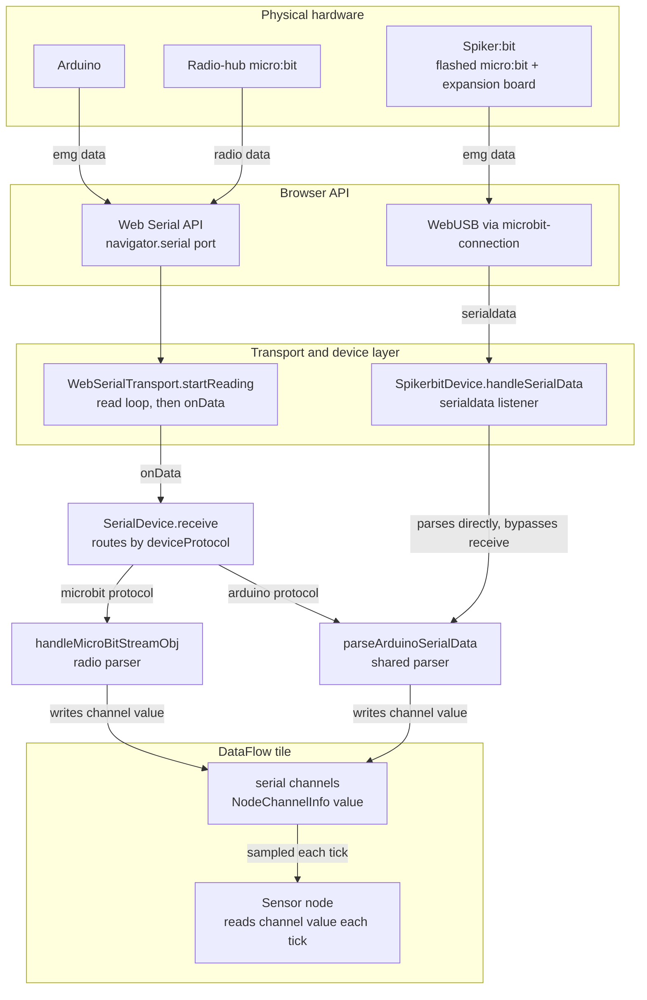
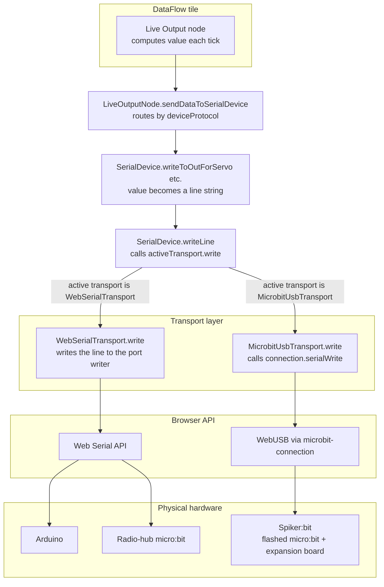

# DataFlow hardware data flow

How serial data moves between physical hardware and DataFlow tile nodes, for the two
current hardware paths:

- **Arduino** (and the radio-hub micro:bit) over the **Web Serial API**.
- **Spiker:bit** (a micro:bit expansion board) over **WebUSB**, via
  `@microbit/microbit-connection`.

Two directions are covered: **inbound** (bytes arriving at the computer → a Sensor node)
and **outbound** (a Live Output node → bytes leaving the computer).

> The diagrams below are shown as pre-rendered SVGs (so they display in any Markdown
> viewer); the editable Mermaid source for each is kept in a collapsed **Mermaid source**
> block underneath. If you edit the Mermaid, re-export the matching SVG in
> `docs/images/`.

## The objects

| Object | File | Role |
|---|---|---|
| `WebSerialTransport` | `src/models/stores/web-serial-transport.ts` | Owns the Web Serial port + read loop; `write()` out, `onData` in. |
| `MicrobitUsbTransport` | `src/models/stores/spikerbit-device.ts` | `IDeviceTransport` over a micro:bit WebUSB connection; `write()` out. |
| `SpikerbitDevice` | `src/models/stores/spikerbit-device.ts` | Spiker:bit connect/version/flash state machine; owns the WebUSB `serialdata` inbound path. |
| `SerialDevice` | `src/models/stores/serial.ts` | Transport-agnostic connection store: holds the active transport + channels, routes writes (`writeLine`) and inbound parsing (`receive`). |
| `parseArduinoSerialData` | `src/models/stores/serial-protocol.ts` | Shared parser: `emg:<n>\r\n` lines → channel values. |
| tile serial channels | `NodeChannelInfo[]` (`.../model/utilities/channel.ts`) | The shared blackboard: parsers write `channel.value`; the Sensor node reads it. |
| `SensorNode` / `LiveOutputNode` | `.../nodes/sensor-node.ts`, `live-output-node.ts` | DataFlow nodes that read inbound values / emit outbound values each tick. |

`IDeviceTransport` (`src/models/stores/device-transport.ts`) is the shared contract:
`write(line)`, `close()`, and optional `onData(chunk)` / `onDisconnect()`.

## Inbound: hardware → Sensor node

Mermaid source

Walkthrough:

- **Arduino (Web Serial):** the physical device emits `emg:<n>\r\n`. `WebSerialTransport`'s
  read loop decodes each chunk and calls `onData`, which `SerialDevice.setActiveDevice`
  wired to `SerialDevice.receive`. `receive` looks up the device's protocol in the
  capability map and dispatches to `handleArduinoStreamObj` → `parseArduinoSerialData`,
  which writes `channel.value` on the matching channel.
- **Spiker:bit (WebUSB):** `SpikerbitDevice` registered a `serialdata` listener on the
  connection. `handleSerialData` calls the same `parseArduinoSerialData` **directly** — it
  does *not* go through `SerialDevice.receive`. (`MicrobitUsbTransport` never invokes
  `onData`.) This asymmetry is deliberate: `SpikerbitDevice` already consumes the inbound
  stream during connect for firmware-version detection, so it owns the inbound path.
- **Into the node:** both paths mutate the same `NodeChannelInfo` objects (the tile's
  `channels`). Each tick the Rete manager samples them and the `Sensor node`'s `data()`
  reads `getChannels().find(...).value`.

> **micro:bit vs. Spiker:bit.** Both are physically micro:bits, but they connect
> differently. A **radio-hub micro:bit** connects over **Web Serial** (same transport as
> the Arduino); `receive` routes its data to `handleMicroBitStreamObj` — a different parser
> — because its `deviceFamily` maps to the `microbit` protocol. The **Spiker:bit** is a
> micro:bit running the flashed CLUE-SPIKERBIT program on an expansion board; it connects
> over **WebUSB** so it can be flashed and read via `@microbit/microbit-connection`.

## Outbound: Live Output node → hardware

Mermaid source

Walkthrough:

- Each tick, the `Live Output node`'s `data()` calls `sendDataToSerialDevice`, which reads
  `serialDevice.deviceFamily`, resolves its protocol via the capability map, and calls the
  matching `SerialDevice.writeToOut…` formatter (e.g. servo-angle scaling).
- The formatter produces a line string and calls `SerialDevice.writeLine(line)`, which is
  the **single unified exit**: `this.activeTransport.write(line)`.
- Only the concrete transport differs: `WebSerialTransport.write` frames the line and
  writes it to the Web Serial port's writer; `MicrobitUsbTransport.write` calls
  `connection.serialWrite`. Neither the node nor `SerialDevice` above `writeLine` knows or
  cares which transport is active.

## Summary of the (a)symmetry

- **Outbound is fully unified**: `writeLine → activeTransport.write` is transport-agnostic;
  the transport is swapped in at connect via `SerialDevice.setActiveDevice`.
- **Inbound is asymmetric**: Web Serial devices flow through `SerialDevice.receive` (which
  picks the parser by protocol), while the Spiker:bit parses in `SpikerbitDevice`. Both
  ultimately call the shared `parseArduinoSerialData` and write the same tile channels, so
  the Sensor node reads values the same way regardless of source.
