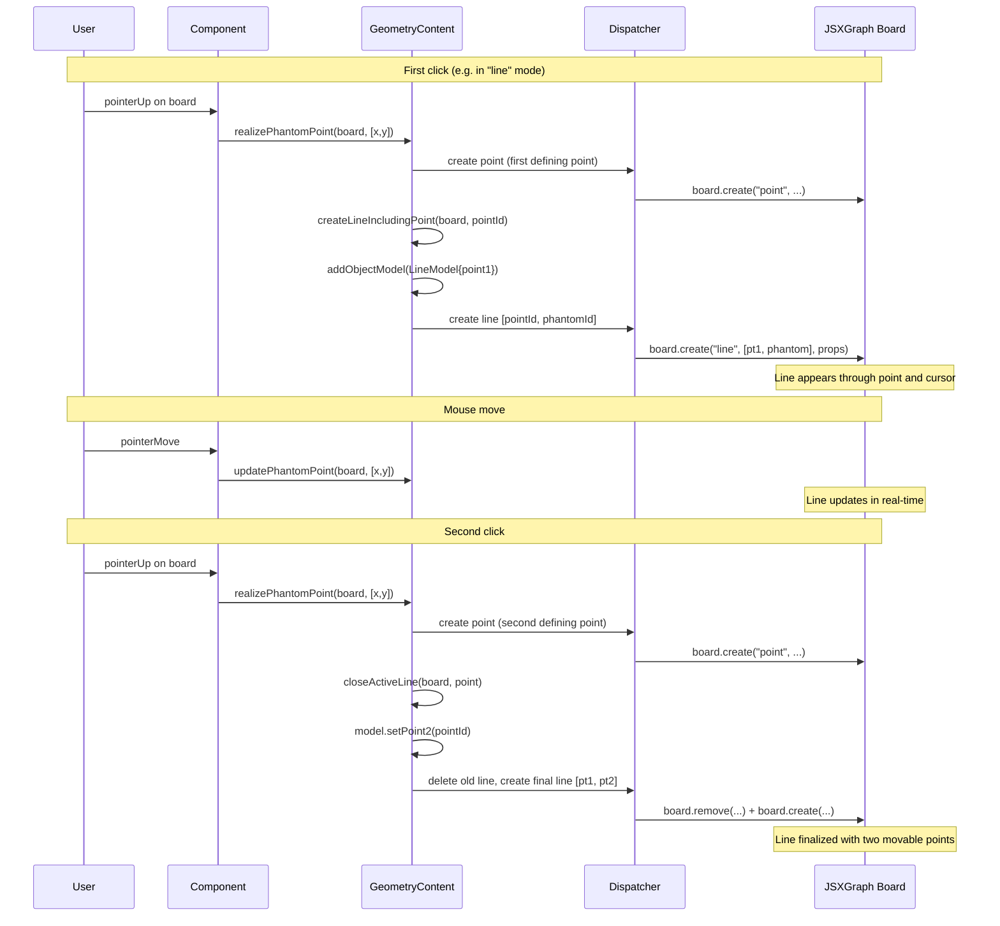
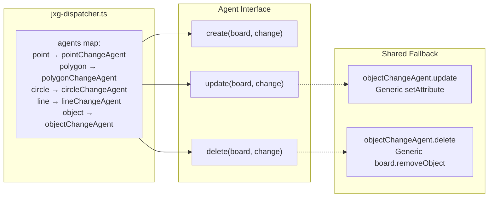
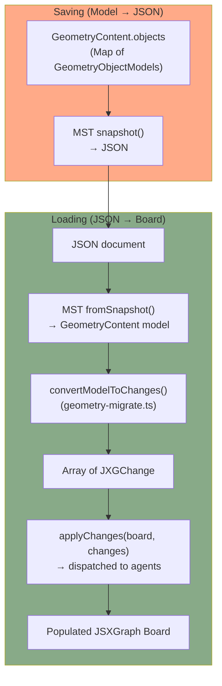
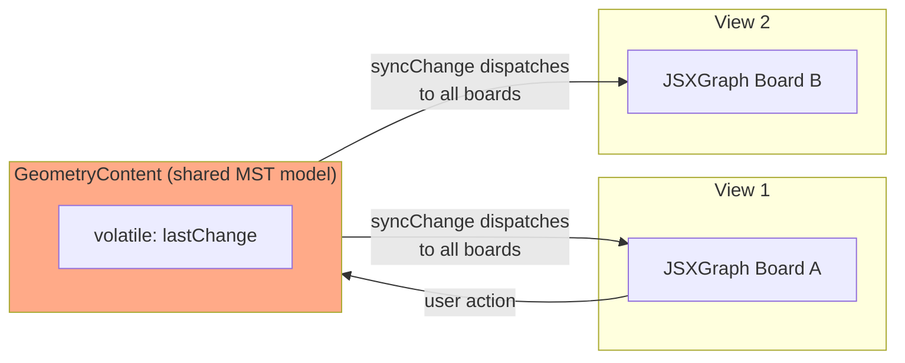

# Geometry Tile: Shape Creation, Rendering, and Persistence

This document explains how shapes (points, polygons, circles, infinite lines) are created, rendered, and saved in the geometry tile. It covers the flow from user interaction through model updates, the JSXGraph rendering layer, and round-trip persistence.

## Overview

The geometry tile uses a **change-based architecture** where all modifications to the JSXGraph board go through a `JXGChange` dispatch system. This ensures that:
1. All views of the same geometry content stay synchronized
2. Changes can be serialized for persistence
3. The JSXGraph board can be reconstructed from the model at any time

```mermaid
flowchart TD
    subgraph User["User Interaction"]
        click{{"Click on board"}}
        drag{{"Drag object"}}
        toolbar{{"Toolbar action"}}
    end

    subgraph Component["React Component<br/>(geometry-content.tsx)"]
        handler["Event Handler<br/>handlePointerUp / handleClick"]
        applyChange["applyChange(board, change)"]
    end

    subgraph Content["Content Model<br/>(geometry-content.ts)"]
        action["Content Action<br/>e.g. createCircleIncludingPoint<br/>realizePhantomPoint<br/>closeActiveLine"]
        addObject["addObjectModel(model)"]
        syncChange["syncChange(board, change)"]
    end

    subgraph Dispatcher["Change Dispatcher<br/>(jxg-dispatcher.ts)"]
        dispatch["dispatchChange(board, change)"]
    end

    subgraph Agents["Change Agents"]
        pointAgent["pointChangeAgent<br/>(jxg-point.ts)"]
        polygonAgent["polygonChangeAgent<br/>(jxg-polygon.ts)"]
        circleAgent["circleChangeAgent<br/>(jxg-circle.ts)"]
        lineAgent["lineChangeAgent<br/>(jxg-line.ts)"]
        objectAgent["objectChangeAgent<br/>(jxg-object.ts)"]
    end

    subgraph Board["JSXGraph Board"]
        jsxCreate["board.create(type, parents, props)"]
        jsxElement["JSXGraph Element<br/>(Point, Line, Circle, Polygon)"]
    end

    subgraph Model["MST Model<br/>(geometry-model.ts)"]
        pointModel["PointModel"]
        polygonModel["PolygonModel"]
        circleModel["CircleModel"]
        lineModel["LineModel"]
    end

    click & drag & toolbar --> handler
    handler --> action
    action --> addObject
    action --> applyChange
    applyChange --> syncChange
    syncChange --> dispatch

    dispatch --> pointAgent & polygonAgent & circleAgent & lineAgent
    pointAgent & polygonAgent & circleAgent & lineAgent -.-> objectAgent
    pointAgent & polygonAgent & circleAgent & lineAgent --> jsxCreate
    jsxCreate --> jsxElement

    addObject --> pointModel & polygonModel & circleModel & lineModel

    style User fill:#88F
    style Board fill:#8A8
    style Model fill:#FA8
```

## The JXGChange Data Structure

Every board modification is expressed as a `JXGChange`:

```typescript
interface JXGChange {
  operation: "create" | "update" | "delete";
  target: "point" | "polygon" | "circle" | "line" | "object" | ...;
  targetID?: string | string[];
  parents?: any[];          // e.g. point IDs for a polygon's vertices
  properties?: JXGProperties;  // id, colorScheme, clientType, etc.
}
```

The `target` field determines which change agent handles the operation.

## Shape Creation Flow

### Two-Click Shape Creation (Circle, Infinite Line)

Circles and infinite lines use a **phantom point** mechanism to show a live preview during creation. The user clicks once to place the first defining point, then a "phantom point" follows the cursor until the second click finalizes the shape.



### Multi-Click Shape Creation (Polygon)

Polygons collect points with each click and close when the user clicks back on the first vertex.

### Single-Click Creation (Point)

Points are created directly at click coordinates.

## Change Agent Pattern

Each shape type has a **change agent** (`JXGChangeAgent`) that knows how to create, update, and delete that shape on the JSXGraph board.



Each agent's `create` function:
- Receives parent IDs and properties from the `JXGChange`
- Calls `board.create(elementType, parents, props)` with computed visual properties
- Sets `clientType` attribute to distinguish shapes (e.g. `"infiniteLine"` vs `"movableLine"`)
- Returns the created JSXGraph element

Most agents delegate `update` and `delete` to `objectChangeAgent` for generic property-setting and removal.

## Persistence: Model to Changes to Board

The geometry tile persists its state as an array of MST model objects (`PointModel`, `PolygonModel`, `CircleModel`, `LineModel`). When the document is loaded, these models are converted back to `JXGChange` objects and replayed on the board.



### convertModelObjectToChanges (geometry-migrate.ts)

This function converts each model object into the `JXGChange` sequence needed to recreate it:

| Model Type | Parents | Notes |
|-----------|---------|-------|
| `PointModel` | `[x, y]` | Coordinates as parents |
| `PolygonModel` | `[pointId1, pointId2, ...]` | References to existing point IDs |
| `CircleModel` | `[centerPointId, tangentPointId]` | Two point references |
| `LineModel` | `[point1Id, point2Id]` | Two point references |

Property renaming happens during migration:
- `labelOption` → `clientLabelOption`
- `name` → `clientName`

This is because JSXGraph uses the `client` prefix convention for custom attributes stored on elements.

## Multi-View Synchronization

When multiple views display the same geometry content (e.g. in different tabs or shared documents), the `syncChange` mechanism keeps them in sync:



`applyChange` writes to the model and calls `syncChange`, which stores the change in a volatile `lastChange` property. Each board component observes `lastChange` via MobX reactions and applies it to its own JSXGraph board via the dispatcher.

## Type Guards (jxg-types.ts)

JSXGraph elements are distinguished using type guard functions that check `elType` and `clientType`:

| Function | Checks |
|----------|--------|
| `isPoint(v)` | `v instanceof JXG.Point` |
| `isPolygon(v)` | `v instanceof JXG.Polygon` |
| `isCircle(v)` | `v instanceof JXG.Circle` |
| `isInfiniteLine(v)` | `elType === "line"` AND `clientType === "infiniteLine"` |
| `isMovableLine(v)` | `elType === "line"` AND `clientType === "movableLine"` |
| `isVisibleEdge(v)` | `elType === "segment"` AND visible (polygon border) |

The `clientType` attribute is critical because JSXGraph uses the same `JXG.Line` class for infinite lines, movable lines, polygon edges, and axes. The `clientType` distinguishes CLUE's shape types from each other.

## Key Files

| File | Role |
|------|------|
| `geometry-content.ts` | MST content model: actions for creating/updating/deleting shapes, phantom point logic, annotation targets |
| `geometry-content.tsx` | React component: event handlers, mode switching, board lifecycle |
| `geometry-model.ts` | MST shape models: `PointModel`, `PolygonModel`, `CircleModel`, `LineModel` |
| `geometry-migrate.ts` | Persistence: `convertModelToChanges()` for loading saved geometry |
| `jxg-dispatcher.ts` | Routes `JXGChange` objects to the correct change agent |
| `jxg-point.ts` | Change agent for points |
| `jxg-polygon.ts` | Change agent for polygons |
| `jxg-circle.ts` | Change agent for circles |
| `jxg-line.ts` | Change agent for infinite lines |
| `jxg-object.ts` | Generic change agent (fallback for update/delete) |
| `jxg-types.ts` | Type guards for distinguishing JSXGraph element types |
| `geometry-toolbar-registration.tsx` | Toolbar buttons and mode switching |
| `geometry-types.ts` | Mode definitions (`"select"`, `"points"`, `"polygon"`, `"circle"`, `"line"`) |
