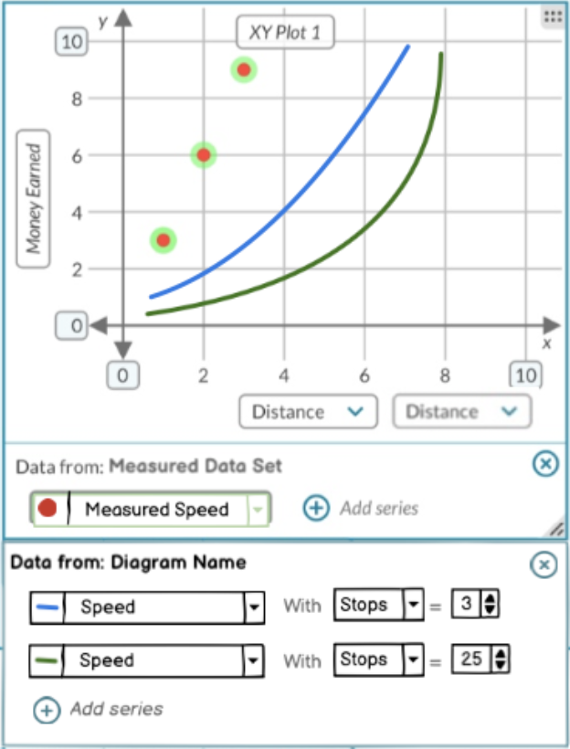

# Graphing variables

We'd like to be able to graph the relationships between variables. The proposal for this is to expand the Plot tile to support it. The Plot would have a new "row" in the legend for the variables. This row would let the user choose a "y" variable and an "x" variable. Then the plot would show a trace which is a function line. An additional feature is that each of these rows could have an additional variable. This additional variable would let the user override an independent variable in the diagram with a different value. The user can add multiple rows to plot multiple traces with different Y variables and/or different "additional variable"s with different values.


There are a few parts to this work:
- how to compute the values to be plotted on the graph
- how the line is actually displayed on the graph
- how the graph tile knows about the variables

# Computing the values

What we need is a Y-value for every point on the X axis of the plot. The value of a variable in the diagram is based on its expression and its input variables. Those input variables might have expressions too with their own input variables. This dependency tree is all handled by MobX. Since any Y variable can be used, this variable might be based on every other variable in the diagram. So we need a way to reuse this calculation engine and scan through the X values and get the Y values.

So basically we need to provide the plot with a function: `computeY(xVariable: Variable, x: number, yVariable: Variable): number`. To handle the control variable we want: `computeY(xVariable: Variable, x:number, cVariable: Variable, c:number): number`.

The plotting code would be calling this for each x value on the x axis. Because there will likely be some setup involved that is common to each of calls. An API that supports that setup is more efficient:
```js
setupCompute(xVariable: Variable, cVariable: Variable, c: number, yVariable: Variable) : {
  computeY: (x: number) => y,
  dispose: () => void
}
```
So the plot would call `setupCompute` with the 3 variables, and the constant value. Then it would call `computeY` with each x axis value. And finally it would call `dispose` when it was all done.This API will probably have to change with some of the more advanced options.

## MVP
We'd prefer not to update the diagram while computing the y values for the trace. It would be confusing for a student to see the values in the diagram changing rapidly. However an MVP this simple approach is a good way to start. So when `setupCompute` is called it:
1. saves the xVariable, cVariable, and yVariable in scope.
2. save the current value of the x variable and c variable
3. updates the value of the c variable to c
4. returns a `computeY` which:
    1. update the value of the x variable to the x parameter
    2. return the value of the y variable
5. returns a `dipose` which resets the x an c variables to their original values

The user will likely see the diagram update sporadically while this is happening. But it might happen so fast they won't see it.

## Advanced Options
In order to separate the scanning of the x values from being shown on the diagram. We have to find a way to use the variable model without actually changing the values in the variable model used by the diagram. Here are some options:
- copy the whole shared variables model, each time a computation is needed
- add support for temporary computations to the shared variable model,
- separate the values from the variables
- independent "case" model
- replace whole Variable model with the DataSet

Note: some of these solutions provide ways to save the value of the constant. And they could easily be extended to allow the user to modify multiple constants. In these case the `setupCompute` API doesn't match up well.

## Copy whole shared variables model
When `setupCompute` is called a copy of the shared variables model can be made. Since this model is an MST model, just getting a snapshot of it and then creating a new instance from this snapshot. A downside of this is it would be a bit inefficient to recreate this model each time. The mathjs instance is probably created each time which might be or leak memory.

## Add support for temporary computations
In this option, the Variable model is changed to include extra properties to hold a temporary value. And extra views are added to use these temporary values to figure out the computed value. This would basically require duplicating a lot code in the Variable model.

## Separate the values from the variables
Refactor the variable system so the values of the variables are separated from the relationships. This way multiple sets of values can be applied to the same variables. The sets of values could be called cases.

This refactoring would require updating all of the tiles that use the shared variable model: Diagram, Simulation, DataFlow, Text Tile (chips), and Drawing Tile (chips). The new interface would mean these tiles would hold references to Variables and then they'd need to look up a Value. This updating of the tiles could be avoided by adding a default case to the variables, but it would make require a tricky circular dependency.

The values model would cache the computed values and also store the input values. The variables would hold the relationships and expressions. There could be multiple value sets for a single variable set. These "value sets" are like cases in the table where each row is a variable. So we could call them cases.

The different traces on the plot could each be stored as a case. These cases for the traces would have a modified value for the constant variable of the trace. The x variable value could be scanned over in place instead of making a copy each time a scan is needed.

This refactoring has the advantage that there could one "active" case and several alternative cases. The user could save changes to the independent variables as cases and then choose to switch the "active" case to one of these saved cases. The diagram and all of the chips could update to show the values based on this active case. As long as the plot is not tracing this active case then the user would not see updates as the x variable value is scanned over.

The data model and UX would have to handle the case where the structure of the diagram is changed. This would mean that cases would either become invalid or they'd just have to get default values from the main diagram.

## Independent "case" model
This is very similar to the refactoring approach of separating the values from the variables. However it wouldn't require updating the tiles that use the shared variables model.

This case model would let the user override values in the existing variables. These overrides would be used both for the constant variable and for scanning the X variable without changing what is shown in the diagram. The plot would have one case for each trace.

An advantage of this approach is that it has built in support for "overriding". The main variable object would contain the main value of the variable. And only the X and C variables would need to be overridden in the case model.

A disadvantage is that these cases could not be displayed in the diagram or chips. And it would also require duplicating some of the code between the Variables and Case Values, so the case value could compute and cache its own version of the values without modifying the main Variable's cache.

## Replace whole Variable model with the DataSet
This approach is the most invasive. The CODAP Dataset now has formula support for attributes. These attribute formulas can be based on other attributes which have their own formulas. So the the variable model in could be represented as a single row (or case) in CODAP with the attribute names being the variable names and the attribute formulas being the variable formulas.

The CLUE DataSet is an earlier version of the CODAP Dataset, so it shouldn't be hard to bring over the updated CODAP DataSet into CLUE.

The benefit of this is that each of the traces can now be a DataSet case. And if we use the hierarchal attribute support in the CODAP dataset that can be used to represent the variables that are being overridden by each trace. The parent attributes would be the ones that are staying the same and the childe attributes would be ones that are changing in each trace.

It would be a lot of work to do this all at once, so the recommendation would be to first bring over the new DataSet then update the CLUE table so the new formula engine is used instead of the existing CLUE formula engine which is in the table. Then add support for units in the new formula engine. The dataset already has a units field. But currently these units are not fed into the formula engine. It uses the same math.js library for the formula engine so we should be able to apply all of our unit work from the variable model to it.

After all of that is working, then we can try replacing the variable model with the dataset attributes.

# Display the line on the graph/plot
From what I understand this is best done with adornments. Ethan and Piotr are working on a function adornment as of Oct. 24. Kirk thinks bringing the latest adornment work over could be done without bringing over the whole graph which is being refactored a lot, and will be very different from our current CLUE plot.

The new CLUE plot code will have layers, one for each dataset and its dataset configuration. The current idea is to link adornments to layers. So this might mean we'll need a dataset configuration without a dataset or an empty dataset so we can plot the function adornment.

# How the graph tiles knows about the variables
To connect these two things together the graph tile will need to know about the variables so it can call `setupCompute` or whatever the API is on the shared variables model. The existing shared model system can be used to connect the shared model to the graph. The problematic part is that the graph/plot would have have to know about the types in the variables system so it could work with them. Currently the variable system is part of the quantity playground repository. So if the graph used these types directly then any unit working with the graph would also need to load in the quantity playground.

One way to address this is for the graph to have a plugin system like the text and drawing tiles. When the variable system is loaded it can register itself as a plugin in the graph. This plugin system in the graph would have to support a few things:
- the graph/plot legend would have to lookup a plugin for any shared models it doesn't know about it. It would know about dataset shared models directly, so initially it would just be shared variable models which it wouldn't know about it. When the plugin is registered it could include the MST type of the shared model the plugin is for. The plot can match this type to this unknown shared model.
- the graph/plot legend would then have to ask the plugin for a component that it could render for the row of the legended.
- this plugin legend component would have to have access to the shared model it is rendering, as well as information about what is on the x-axis.
- The plugin would also need to be able to add the function adornment to the graph. I don't know if these adornments are added at the model level of the graph or at the component level. If it is at the component level then probably the plugin legend component could do this. If it is at the model level then this might require a new object or callback registered by the plugin which can manage to add this adornment as needed.
- if the adornment is saved in the graph/plot state then it is likely the plugin would need to register a new adornment MST type so it could be saved and reloaded. This dynamic registration of MST types is used in a few places in CLUE. `drawing-object-manager.tsx` is a good example of this.

# Random Implementation Notes

## Separate case from variables
We could call this a "case" so it lines up with the CODAP concept of the case table. It might be good to have a slightly different name both to not conflict with CODAP and because `case` is a reserved word in javascript.

This would probably need to be a MST model. This way it could have references to the variables. And it could be serialized. It would be necessary to serialize it to save the current state of the diagram. And each trace on the graph would have its own value set.

If we don't switch to just using the dataset attributes for these variables, we could at least provide a way to sync a table with them to visualize them.

Probably having the variable shared model contain all of the variable sets is the best approach. This would keep us in line with the idea of representing a dataset in a different way.

In the current UX there'd be one case that would be managed by the diagram. In the future it might support pointing at different case. And then the graph would create additional cases for each trace.

In the current UX the graph would only be overriding 2 input values in the case. The remaining input values should remain in sync with the main diagram case. To address this, a case can have a "parent" case. If an input value isn't specified in the case the value is taken from the "parent" case. This is similar to CODAP's parent cases. It might be worth trying to mirror its implementation if possible.

Alternatively we could consider changing the UX to expose the cases more. This way we could avoid this parent case stuff. The student would then switch between cases in the diagram and update the values that they want to. This would be pretty inconvenient if there are common constants that need to be changed rarely. The student would have to change them in all of the cases.

### Using 2 types of values
With the values separate from the variables it might make sense to have different models for independent values and computed values. This will complicate the diagram react components, they'd have to switch based on the type of the value. It will also mean that when a variable changes type then all references to the Value have to be updated to the new instance. So this isn't a good idea, but for reference below is some notes on doing this.

```js
const VariableValue = types.model("VariableValue")
.views(self => ({
  get case() {
    self.getParent().getParent() // values are children of a map in a case
  }
  get computedValue() {
    throw "Need to implement this"
  }
});

VariableValue.named("IndependentValue").props({
  value: types.number
})
.views(self => ({
  get computedValue() {
    return self.value
  }
}))

VariableValue.named("DependentValue").props({
  variable: types.ref(Variable)
})
.views(self => ({
  get case() {
    self.getParent().getParent() // values are children of a map in a case
  }
  get computedValue() {
    const {inputVariables, expression} = self.variable;
    // These inputValues can be either ComputedValue or IndependentValue objects
    const {inputValues} = inputs.map(inputVar => self.case.getValue(inputVar));
    return evaluate(expression, inputValues);
  }
}))

```

When a variable switches from an independent to a dependent variable. Its old `IndependentValue`s will become broken. So something at the case level would have to watching for this and then delete the old values and change them. And then it means the components in the diagram would have to also get re-pointed to the new values. If the components in the diagram always look up the value from the diagram's current case they not need re-pointing.

So the main question is how the case would watch for changes of the type of variable. It'd probably have to be an autorun. Given that we already have logic in the variables for them to handle being both types, it seems better to just stick with that approach.

What would this look like for a simple variable set. Lets say we have variables x, y, z. The formula for z is x+y. So there would be 3 Variable objects.

In diagram the values are x:1, y:2, and z is computed to 3.

The diagram has a reference to the current "case". Each node/card in the diagram references a variable id like now. When the node wants to display its value it finds the value in the diagram's case for its variable. This "value" is an observable object not a number. It has a views "computedValue" and "computedUnits". It has a property of "variable". The "computedValue" view gets the "Value" object for each of the input variables of

## TODO:
- Figure out how the current legend rows work
- Figure out if the plot should have a plugin system, so the variable model can be plugged into it like it is for the text and drawing tiles
- Figure out how the adornment system works so we can use it for plotting a function without points
- Figure out how the updating mechanism works for the adornment system so we can re plot the function if the visible range changes
- Decide which of the 3 options to use for computing the y value given an x value. I'm currently leaning towards the first option.
- Figure out how to describe this approach better.
- See if there is an overlap between the variable value refactoring and the issues with the simulations playing the variables by changing them on each time step. There might also be some separate feature of the CLUE system specifically for handling animating or playing states.
