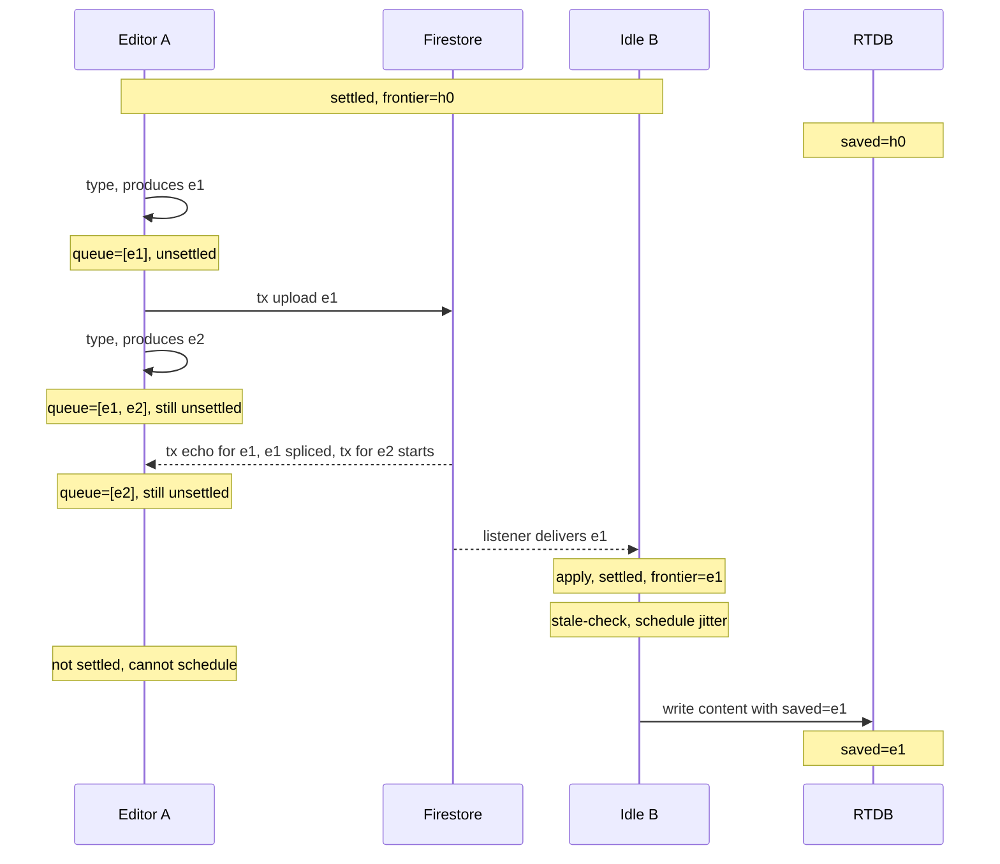

# Settled-State Document Saves Design

**Status**: Design complete, ready for implementation plan
**Date**: 2026-04-29
**Author**: Scott Cytacki (with Claude)
**Related**: [group-docs-plan.md](group-docs-plan.md), [group-docs-current-state.md](group-docs-current-state.md), [transaction-free-history-design.md](transaction-free-history-design.md), GD-6 / CLUE-485

## Summary

Today, every CLUE client saves the full document state to RTDB on every local change *and* on remote changes that get applied. This produces two problems for group documents:

1. **Multi-writer save thrash.** When a group has N active editors, a single edit triggers ~N RTDB writes of the full document, because every client whose local model is updated re-saves. Most of those writes are redundant — they all converge to the same content.
2. **Saved-doc inconsistency with canonical history.** The current code saves whatever the local model is at the moment of the save, regardless of whether that state matches the canonical history. With concurrent edits and fork-rollback (GD-6), the saved doc can briefly reflect a non-canonical state.

This design proposes:

- **Save when settled**: only save the doc when the local receive-side state machine is in a settled state (no pending local entries, no pending conflict decisions, all visible canonical entries processed). The saved doc always reflects canonical state at a known canonical position.
- **Reduce duplicate saves**: minimize (not eliminate) redundant writes via a stale-check + jitter protocol; idle observers naturally do most of the saving.

**Trade-off worth flagging.** Today, read-only viewers (e.g., a teacher watching a group) only see updates when an editor saves the doc, which currently happens on every change. Under save-when-settled, saves are less frequent, so read-only viewers will see longer latency between a remote change and their view updating. Mitigating this by having read-only viewers replay canonical history themselves is left as follow-up work — see § Follow-up work.

## Why this is its own design

This work was identified during brainstorming for [transaction-free-history](transaction-free-history-design.md). That design depends on a saved-doc invariant ("the saved doc reflects canonical state at a known canonical position") that today's code does not guarantee. Rather than entangle the saved-doc work into the larger DAG-restructuring spec, separating them lets us:

- Land the saved-doc improvements independently and benefit from them under the current transaction-based design.
- Treat this as a dependency of the transaction-free-history work — that work assumes the invariant holds.
- Address multi-writer save thrash, which is an independent value-add.

## Goals

1. Reduce redundant saves of the group document — ideally one save per logical change, not N.
2. Saved doc always reflects canonical state at a known canonical position. No "snapshot mid-conflict" anomalies.
3. Support the saved-doc invariant the transaction-free-history design needs.

## Non-goals

- Compaction or pruning of canonical history. Saved docs don't replace history; they're a load optimization.
- Server-side snapshot generation (e.g., Cloud Function maintaining a canonical state cache). Possible future work; out of scope for this design.
- Changes to how non-group (personal) documents save. Personal docs save on every change today; switching them to save-when-settled risks more lost work in a pathological never-settles session, and there's no second writer to absorb the save on the user's behalf. Scoped to group docs only for now; worth revisiting once we have measurements on how often documents actually settle in practice.
- Closing the read-only viewer latency gap introduced by less-frequent saves. Tracked as follow-up work, not part of this design.
- Migrating existing group documents. Group docs are still experimental and have no real users yet; existing saved state can simply be overwritten by the next settled save under the new code, with no special reconciliation pass.

## Background

### How saves work today (group docs)

Group documents go through the same save path as personal documents:

- The client's local MST model is the source of truth for the saved doc.
- An onSnapshot-style observer (or equivalent) watches the model and writes the full content to RTDB on every change.
- This includes changes from local user actions AND changes applied from remote history entries (via the receive-side history manager).
- All editors save independently — there's no coordination.

For a group with two editors A and B both watching the same doc:
- A makes an edit. A's model updates. A saves to RTDB.
- The history entry uploads. B's listener delivers it. B applies it to B's model.
- B's model updates. B saves to RTDB.
- Both writes target the same RTDB doc. Last-write-wins. Most of the time, both contain identical content.

This is wasteful in writes and creates a small but real window where the RTDB doc can flip back and forth between A's and B's near-identical versions, depending on which write commits last.

### How read-only viewers work today (and why this design affects them)

A user opening the group document in read-only mode (e.g., a teacher viewing a group's work) loads the doc from RTDB and renders it. The current implementation does not subscribe to canonical history entries for read-only views — the viewer sees only the saved-doc state, refreshed when the saved doc changes.

Saves happen on every change today, so a teacher's view stays roughly current. After save-when-settled lands, saves become less frequent, and that view will visibly lag remote changes. This design accepts that regression; closing it (by having read-only viewers replay canonical history) is follow-up work.

### The transaction-free-history connection

The new history design assumes the saved doc reflects canonical state. Without this invariant:

- A saved doc with a non-canonical "loser" entry applied looks like canonical state to a late-comer, but isn't.
- The fix proposed in that doc requires the saved doc to record a `tips` frontier matching canonical entries — which only makes sense if the saved doc IS canonical state at those tips.

Today's "save on every change" approach can write non-canonical states, so the new history design needs save-when-settled (or equivalent) as a precondition.

## Concept

### Save when settled

The local receive-side reaches a **settled** state when all three hold:

1. **All local writes have committed canonically.** No local entry has been produced but is still waiting on its server-side acknowledgement at a canonical position.
2. **All delivered remote entries have been processed.** Every entry the listener has handed us has been applied (as a winner), skipped (as a loser), or recognized as already present.
3. **No conflict resolutions are outstanding.** Every conflict between a local and remote entry has been decided, and the resulting state is reflected in the local model.

When all three hold, the local model matches canonical state at the current frontier — and `treeManager.latestDocumentHistoryEntry.id` is a meaningful value to put in the envelope's `lastHistoryEntryId`. **That is the moment to save the doc.**

**Mapping to today's code** (`firestore-history-manager-concurrent.ts`):

1. `completedHistoryEntryQueue.length === 0` AND `!uploadInProgress` — no local entries waiting for the upload transaction, and no transaction in flight.
2. `applyInProgress` resolved AND `pendingDownloadBuffer === undefined` — no listener delivery currently being applied, and nothing buffered behind `pausedDownloads`.
3. Implied by (1). `detectAndResolveFork` runs synchronously inside `applyHistoryEntries`, so once the queue is empty and apply isn't running, no conflict can be outstanding.

The `paused` / `pausedDownloads` debug flags don't change the definition. If they're set with pending work, the document simply stays unsettled until the flags are released — which is the correct behavior; we don't want to save mid-fork-injection-test.

**Mapping to transaction-free-history (future):**

1. `pendingLocal` is empty.
2. Every listener-delivered entry is reflected in `canonical` (winners applied, losers marked) — no entry is sitting unprocessed.
3. `pendingDecision` is empty. Implied by (1): `pendingDecision` entries only block on `pendingLocal`, so once `pendingLocal` empties and the consequent re-evaluation completes, `pendingDecision` empties too.

**Observability.** None of `completedHistoryEntryQueue`, `uploadInProgress`, or `applyInProgress` are MobX-observable today. The save trigger needs to be reactive (an autorun watching the settled predicate), so making these observable is part of this work — and prepares the ground for the transaction-free state machine, which will need the same observability for the same reason.

Settled states occur naturally:
- Between user actions, when the upload queue empties.
- After conflict resolution completes.
- During listener-quiet windows.

In active sessions, settlement happens many times per minute. The save just rides those moments.

### Saved-doc envelope

GD-6 already added a `lastHistoryEntryId` field to the RTDB document envelope (`DBDocument` in `src/lib/db-types.ts`) so the load-side drift check can compare the saved content to the Firestore history chain. Each save writes whichever entry id the local tree manager reports as `latestDocumentHistoryEntry`. The envelope today is roughly:

```
{
  content: <doc state>,
  lastHistoryEntryId?: <entry id>,
  // version, self, changeCount, type — pre-existing
}
```

Under save-when-settled, the *meaning* of `lastHistoryEntryId` tightens rather than the shape changing. Today the field records "the last entry the local model had seen when this snapshot was captured," which can be a non-canonical tip mid-conflict (the original drift scenario GD-6 only partially mitigates). After this design, it records "the canonical entry at which this saved content is the canonical state" — the stronger invariant the transaction-free-history design relies on.

No new field is required for today's single-parent history. When transaction-free-history lands and the history becomes a DAG, the singleton `lastHistoryEntryId` will need to generalize into a multi-id `tips` frontier; the existing field gives a clean place to evolve (and in the singleton case, `tips ≡ [lastHistoryEntryId]`).

### Reducing duplicate saves

If every settled client saves independently, we still have multiple saves of the same content. The goal here is to *minimize* duplicates rather than eliminate them: an occasional redundant write of identical canonical content is much cheaper than the coordination protocol needed for strictly-one-saver.

The proposed mechanism is **stale-check with random jitter**:

- Each client subscribes to the saved doc's `lastHistoryEntryId` (already on the envelope post-GD-6) — the existing RTDB doc listener already covers this.
- When the local machine settles, compare the local frontier to `lastHistoryEntryId`. If equal/ahead, the saved doc is current — skip.
- Otherwise, schedule a write after a small random jitter (e.g., 0–200 ms). Re-check before writing; if the saved doc has advanced past the local frontier in the meantime, cancel.

The activity-shifts-load property the multi-writer-thrash goal wants falls out of *when each client reaches settled*, not from any explicit weighting:

- An idle observer settles the moment a remote entry applies.
- An active editor doesn't settle until their upload echo lands and the local queue drains.

So observers start their jitter timers earlier and usually win the race; active editors usually find the doc already current and skip. Random jitter just spreads ties among equally-idle clients.

Duplicates aren't fully eliminated — two clients can still race within the jitter window — but their writes contain identical canonical content (same `lastHistoryEntryId`), so a duplicate costs one extra RTDB write, not divergence. This is much simpler than presence-based election (no leader, no handoff, no disconnect protocol) and avoids the operational cost of a server-side saver.

Tuning the jitter range and the upper bound on settled→write delay is left to implementation; the all-editors-no-observer case is the worst case for that bound (everyone delays a little before the first save lands).

## What we've learned (during brainstorming)

These are conclusions from the conversation that produced this draft. They're not exhaustive but represent the current shared understanding.

### The saved doc reflects canonical state, not local state

The fundamental shift: the saved doc is a snapshot of *canonical history applied up to a known frontier*, not a snapshot of "whatever this client's model happens to look like right now." This is what makes late-comers' loads correct in the presence of concurrent edits and conflict resolution.

### Snapshot-per-entry doesn't simplify

A natural-seeming idea — snapshot the doc state when each entry is created, save the snapshot when the entry commits — doesn't work cleanly. The snapshot reflects the local view at entry-creation time, not canonical state at the entry's eventual canonical position. If a remote entry commits canonically before the local entry, the snapshot is missing that remote's effects. To get a correct snapshot, you'd have to take it AFTER the receive-side machine has reconciled the entry's position to canonical — which is just "save when settled" by another name.

### Firestore listener consistency mitigates timing concerns

Firestore listeners deliver consistent snapshots: a snapshot at time T includes all writes with `serverTimestamp ≤ T`. So if a listener delivers entry e with timestamp `T_e`, every earlier-committed write is in the same snapshot or an earlier one. This means the receive-side machine won't see "out of order" deliveries that violate canonical ordering.

(There's still in-flight latency on uncommitted local writes; that's handled by the in-flight window logic in the transaction-free-history design and isn't this design's concern.)

### Inline-pending-entries is unnecessary if we save-when-settled

We considered embedding not-yet-uploaded local entries inside the saved doc envelope so late-comers could revert them. That preserves work in the no-conflict case (B closes browser; D loads; D promotes B's entries). But once we settled on "don't promote, just revert," the inline approach loses its value vs. simpler save-when-settled. Late-comers don't need the embedded entries because the saved doc never reflects un-uploaded state.

### "Never settles" risk is bounded

The worst case for save-when-settled is a session that never reaches a settled state — saves never happen, late-comers replay arbitrary amounts of canonical history at load. In practice:

- DataFlow tick-rate writes belong on the background channel, not the user channel — they don't block user-channel settlement.
- Even fast typing has 100ms+ gaps; uploads finish in 100–500ms; settlement is reachable many times a minute.
- Late-comer load cost grows with un-saved canonical history, but that's a load-time cost, not a correctness issue.

If load-time cost becomes problematic, server-side periodic snapshots are a known mitigation.

### No force-save triggers needed

Force-save mechanisms (periodic timer, inactivity hint, `beforeunload` handler) were considered. The conclusion is that natural settlement plus the existing CLUE document lifecycle already covers the cases force-saves are meant to address:

- **Pathological "never settles."** This means `pendingLocal` is unable to drain — the local model is overlaid with uncommitted changes that aren't canonical state. Force-saving would write that non-canonical state, violating the central invariant; it can't help here. The right fixes are upstream — DataFlow on the background channel (designed) and surfacing sync failures to the user (existing TODO in `firestore-history-manager-concurrent.ts`).
- **Tab close during an un-settled state.** Local entries still in the queue are lost regardless. This is true today; not a regression of save-when-settled.
- **Document switching via UI.** Already safe: `closeDocumentGroupPrimaryDocument` only updates tab state. The document stays in `documents.all` and its `FirestoreHistoryManager` keeps draining the upload queue in the background. No code destroys documents during a session, so the snapshot-listener-disposer wired via `addDisposer(treeManager, …)` doesn't fire either. Background drain handles this case.
- **Late-comer load cost.** Bounded by the canonical history accumulated since the last save. Any session active enough to grow that cost is also active enough to settle, since settlement happens many times per minute in normal use.

A `beforeunload` handler that short-circuits the jitter delay when the client is currently settled-but-jittering is a small possible future improvement (cuts at most a ~200 ms staleness window in solo sessions). It is not part of this design; revisit if measurement shows the jitter window matters.

### Existing FIXME is fixed as a side effect

`firestore-history-manager-concurrent.ts` has a FIXME (around line 84) about a race in the initial history load: the saved doc content and the `metadata.lastHistoryEntry` are fetched separately, and entries committed between the two fetches are mishandled. The fix proposed in the comment is to use a saved-doc-embedded entry id during initial load. GD-6 added that field (`lastHistoryEntryId`); this design's canonical-state invariant makes the field reliable enough to source the initial-load entry id from. **When this work lands, the FIXME comment should be removed.**

## Worked scenarios

These walkthroughs validate the protocol against representative multi-client situations. Each assumes today's transaction-based send-side model (the design lands first under that model) plus save-when-settled + stale-check + jitter on the receive side. RTDB's saved doc state is shown as `saved=<lastHistoryEntryId>`. `h0` is the canonical head when the scenario starts.

### 1. Solo editor — sanity

Setup: client A only. `saved=h0`.

1. A types → `e1`. Queue=`[e1]`. A unsettled.
2. A's transaction commits `e1`. Queue empties. A settled, frontier=`e1`.
3. A's stale-check: `saved=h0` ≠ `e1`. Schedule jitter.
4. Jitter fires. Re-check still `h0`. Write `{content, lastHistoryEntryId=e1}`.

**Validates:** the protocol degenerates correctly to "the only client saves what it produces." No coordination overhead.

### 2. One editor in a burst, one idle observer — duplicate reduction

Setup: editor A in a typing burst, idle B. `saved=h0`. The interesting effect appears when A is producing entries faster than uploads complete: A is **never settled** during the burst, so A's stale-check never triggers a save. B settles every time a remote entry lands and saves at each canonical position. A's saves don't lose a jitter race — A isn't eligible to schedule one.



For an isolated single edit (A types once and stops), both A and B reach settled at roughly the same moment, and the save is a true random-jitter race — small probability of duplicate writes of identical content. The burst case is where the activity-based effect actually does the work; the single-edit case is where random jitter does.

**Validates:** the duplicate-reduction protocol relies on settled-time, not on id-based assignment or explicit activity weighting. During bursts (which is where save thrash would be worst today) the editor is unsettled throughout, and the observer absorbs every save. Random jitter is the fallback for the simpler tied case.

### 3. Two editors, conflicting edits — canonical-state invariant (critical)

Setup: editors A and B both editing the same tile (overlapping scope) concurrently. `saved=h0`. `expectedRemoteHead = h0` on both.

1. A and B locally produce `eA` and `eB`. Both unsettled. Both kick off upload transactions.
2. A's transaction commits first. Server head = `eA`.
3. B's transaction reads metadata, sees `lastHistoryEntry=eA` ≠ B's `expectedRemoteHead=h0` → throws `RemoteHeadChangedError`. B's queue stays `[eB]`. B still unsettled.
4. B's listener delivers `eA`. `applyHistoryEntries` runs `detectAndResolveFork`. `partitionLocalEntriesForMerge` finds `eB.scope` overlaps `eA.scope`. `rollbackLocalEntries(1, …)` applies inverse patches, appends a revert entry for the scrubber, and removes `eB` from the queue.
5. B's queue empty, apply finished, frontier=`eA`. B settled.
6. A's queue is already empty from its own echo, frontier=`eA`. A settled.
7. Both schedule jitter. Whichever fires first writes `{content reflecting eA only, saved=eA}`; the other cancels.

Critical observation: between step 1 (B applied `eB` locally) and step 4 (B reverted `eB`), B's model held a non-canonical state. Today's save-on-every-change would have written that state to RTDB, so a late-comer joining during the window could load a non-canonical doc and then incorrectly compose canonical entries on top. Save-when-settled prohibits any save during this window because B's queue is non-empty.

**Validates:** the canonical-state invariant. **This is the central correctness property the design exists to provide**, and it's the precondition the transaction-free-history design relies on.

### 4. Late-comer load

Setup: a session has been running. The saved doc was last written when canonical head was `h_save`. Since then, K canonical entries have been added to Firestore (and not yet captured in a save).

Client D opens the document:

1. Load RTDB envelope: `content` (canonical state at `h_save`) + `lastHistoryEntryId=h_save`.
2. Load Firestore canonical history; identify entries after `h_save`.
3. Apply those K entries through the receive-side machine.
4. D's local state = canonical state at the current head.

**Validates:** the load procedure works because saved content is guaranteed canonical at `h_save`. Without that guarantee (today), step 3 would compose canonical entries on top of possibly-non-canonical content.

### 5. Three idle observers — jitter race

Setup: editor A produces `e1`. Observers B, C, D all idle. `saved=h0`.

1. `e1` lands canonically. All four clients apply `e1`, settle with frontier=`e1`.
2. Each non-editor schedules a jitter. Say B=50ms, C=75ms, D=110ms.
3. At 50ms: B's timer fires. Re-check still `h0`. B writes `saved=e1`.
4. RTDB pushes the update. Listener latency ~10–50ms.
5. At 75ms: C's timer fires. C's cached `saved` may already be `e1` → cancel. Or still `h0` → C also writes (duplicate, identical content).
6. At 110ms: D's timer fires. D's cache almost certainly updated → cancel.

**Validates:** random jitter spreads timers across the listener-delivery latency window. Duplicates can still happen when timers fall within that window, but the duplicate write is identical canonical content (last-write-wins is a no-op). Cost of a collision is one extra RTDB write, not divergence.

### 6. Long typing burst

Setup: A typing fast (>10 keystrokes/sec). B is idle.

- A's queue accumulates entries faster than transactions clear them; A is rarely settled.
- Each transaction commits a batch (up to 20 entries). The listener fires on B for each batch.
- B settles after each batch, schedules jitter, saves canonical state at the batch's last entry.
- B's saves capture canonical state at every batch boundary (typically every 100–500ms).

If A is the only client (no observers), A's queue may rarely empty during the burst. A is rarely settled. Saves don't happen during the burst. When A pauses (between sentences, etc.), the queue drains, A settles, A saves.

**Validates:** the design relies on observers and pauses to absorb save cadence; both are abundant in normal use. Pathological bursts skip saves during the burst itself but settle afterward — load cost grows briefly but state stays correct.

### 7. Solo editor, never-settles

Setup: pathological — A is the sole client and produces entries continuously, queue never empties.

- No saves occur during the burst.
- If A closes the tab: queued entries are lost (baseline behavior, true today).
- If a late-comer joins: loads the stale saved doc + replays canonical history since `h_save`. Late-comer arrives at correct state.

**Validates:** the "no force-save triggers" decision. Force-saving non-canonical local state would violate the invariant; doing nothing is correct, and the worst case is bounded — load cost grows but state stays correct.

## Follow-up work

### Read-only viewer history replay

This design makes saves less frequent, which lengthens the latency between a remote edit and a read-only viewer (e.g., a teacher) seeing it — they currently rely entirely on the saved-doc cadence. The mitigation is to have read-only viewers subscribe to canonical history entries (Firestore listener) and apply them on top of the loaded doc, reusing the receive-side machinery editors use. Mechanical to build, but explicitly excluded here to keep the initial change small. Worth picking up once save-when-settled is in production and the latency impact is measurable.

## Relation to other work

- **Transaction-free-history**: this design is a prerequisite. Land save-when-settled first; then transaction-free-history can rely on the canonical-state invariant.
- **GD-9 / GD-10 (Document and Shared Model Merging)**: orthogonal. Most of GD-9 has merged to master; this design works with whatever the receive-side machine produces.
- **GD-11 (Tile Hardening)**: orthogonal.
- **GD-12 (Debug Re-render Controls)**: useful for shaking out bugs in this work.
- **GD-13 (Auto-Revert Stress Mode)**: should exercise save-when-settled timing edge cases.
- **Background channel (2026-04-27)**: orthogonal — background entries don't block user-channel settlement.
