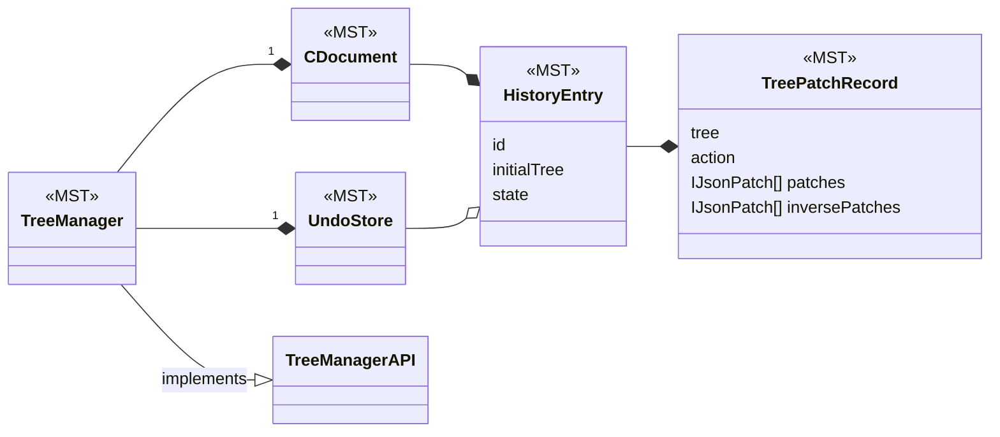
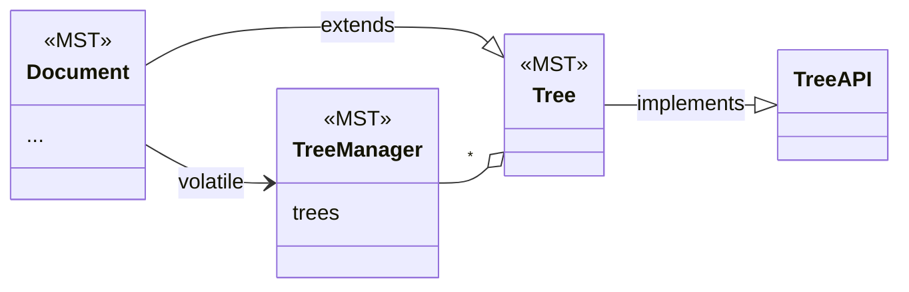
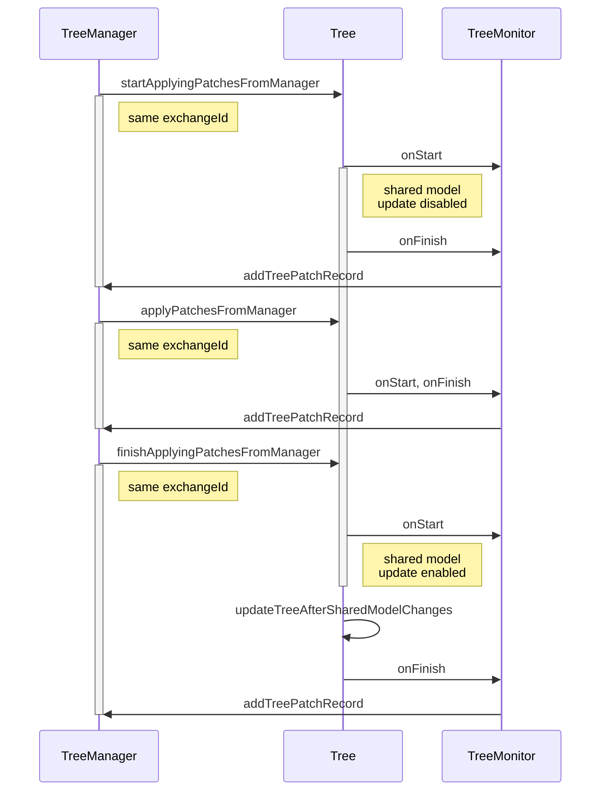
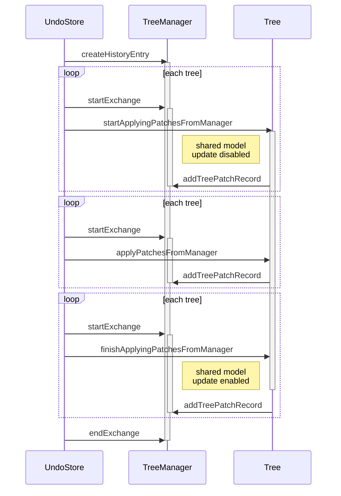
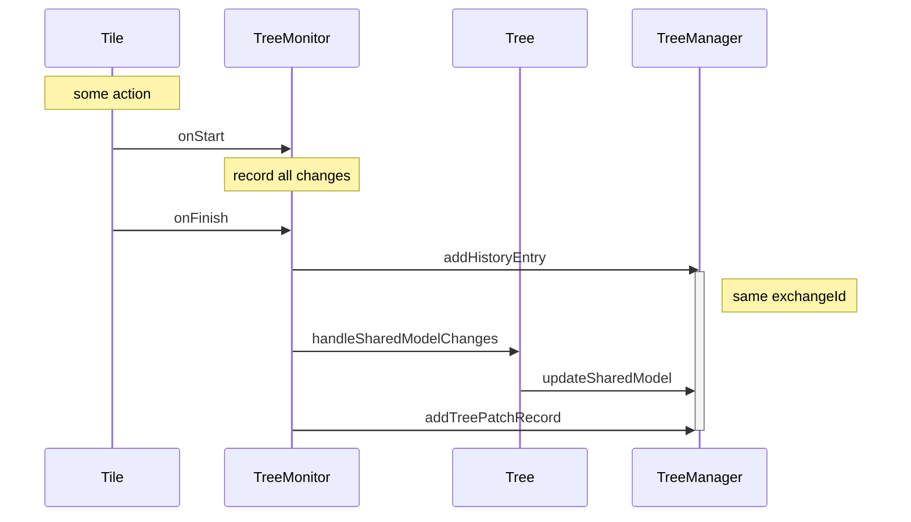
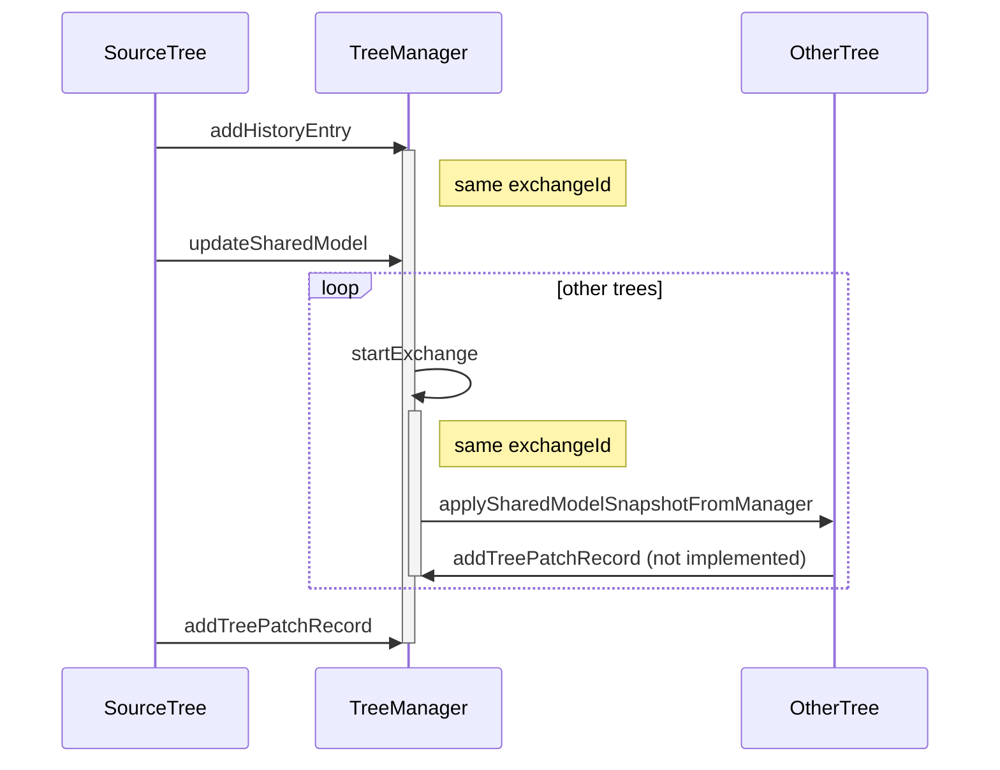

# History Framework

The history framework in CLUE is used for recording changes to documents to support undo/redo and time traveling.

The framework is based on MobX State Tree (MST). It is intended to support iframe based tile implementations. With iframe based tiles there will be multiple MST trees that need to coordinate with each other. However, we do not currently have any iframe tiles, so this capability of the system hasn't been tested yet.

The main parts of the system are:
- `TreeAPI`: this is the interface used by the TreeManager to work with the trees. It is intended to work over postMessage. Its methods are well documented.
- `TreeManagerAPI`: this is the interface used by trees to work with the TreeManager. It is intended to work over postMessage so trees in iframes can communicate with the TreeManager in the host page. Its methods are well documented.

- `TreePatchRecord`(MST): This is set of patches for a single tree. It represents what the MST action tracking middleware returns (action, patches, inversePatches)
- `HistoryEntry`(MST): This is a container of TreePatchRecords. It represents the full action which could be modifying multiple trees. It also keeps track of whether there are outstanding tree patch records that haven't been recorded yet.
- `CDocument`(MST): (change document) This has the list of history entries. It can be serialized independently to record the history of changes to the document.
- `UndoStore`(MST): This has a list of references to history entries as well as the index of the current entry that has been undone.  It would normally not be serialized itself. It uses references so we aren't keeping 2 copies of each history entry. It has actions to apply the undo and redo by applying patches to the affected trees.
- `TreeManager`(MST): This contains a CDocument and an UndoStore. It also tracks the set of trees. It implements the TreeManagerAPI.

- `Document`(MST): this creates the TreeManager in afterCreate, and stores it in its volatile prop.  It sets up the tree monitor with the Document, and TreeManagerAPI. It also adds itself as a tree to the TreeManager's array of trees. This is the main entry point to the history system. It is also the MST object that is serialized as the CLUE user document. It is not great that the Document is a tree and also initializes the TreeManager which is managing trees. 
- `Tree`(MST): a MST model that Document extends. It provides actions that Trees need. It is providing the implementation of the TreeAPI. It is intended to be generic and usable by any MST model that wants to be a tree. However currently it has references to DocumentContentModel, Tiles, and SharedModel. The worst of this is the DocumentContentModel. The idea would be that a iframe based tile would have a different root instead of DocumentContentModel and this root would include the Tree. So if the Tree had some view to get the sharedModelMap this would then be implemented by each root.
- `TreeMonitor`: a class which adds a MST middleware for recording actions.

## MST Models to store History and Undo

## Connection of History to CLUE Document

## Undo, Redo, Replay History

### From the tree's point of view

### From the TreeManager point of view

## Recording a change to a tile and shared model

### From the Tree's point of view
This is usually triggered when an action is called on a tile.

### From the TreeManager's point of view

## TODO:
- [ ] UndoStore.redo and UndoStore.undo do not handle async well, they are changing the undo index before all of the patches have been applied to the trees.
- [ ] review how exchangeId is handled when an undo triggers a call to updateSharedModel, should a new exchangeId be generated here or should it be re-using an existing exchangeId?
- [ ] try to unify Document.afterCreate with createDocument
- [ ] move some of the large comments in the code into this document and put references in the code.
