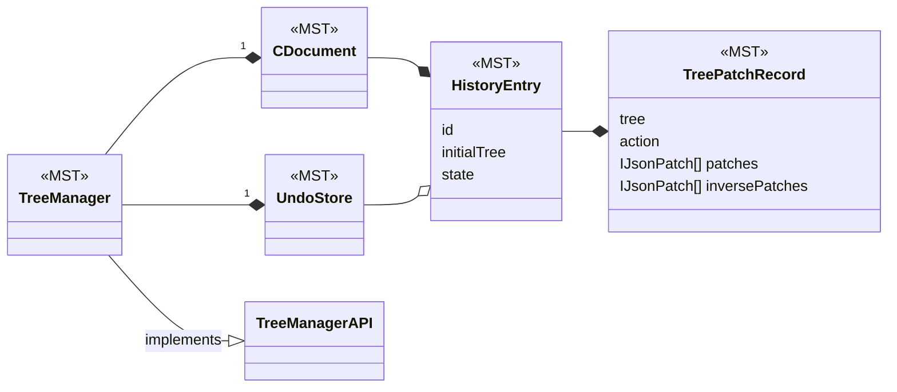
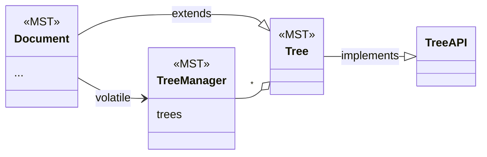
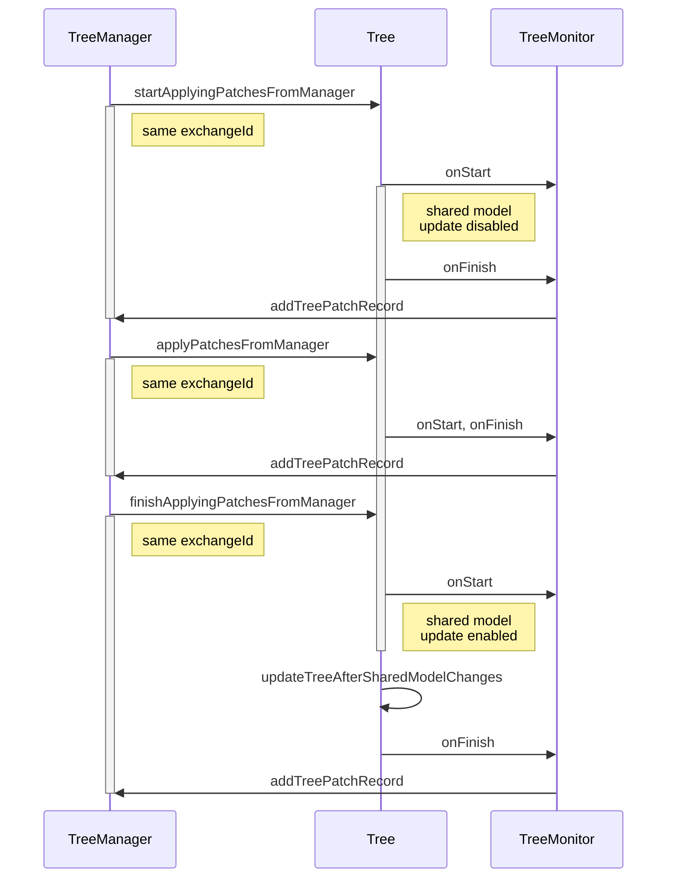
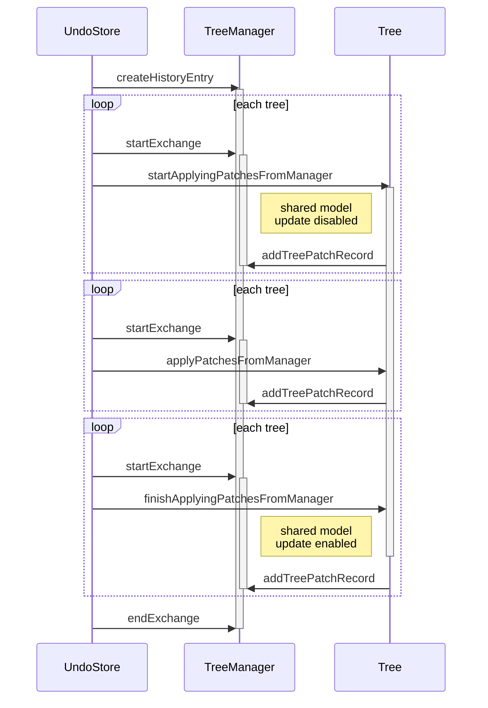
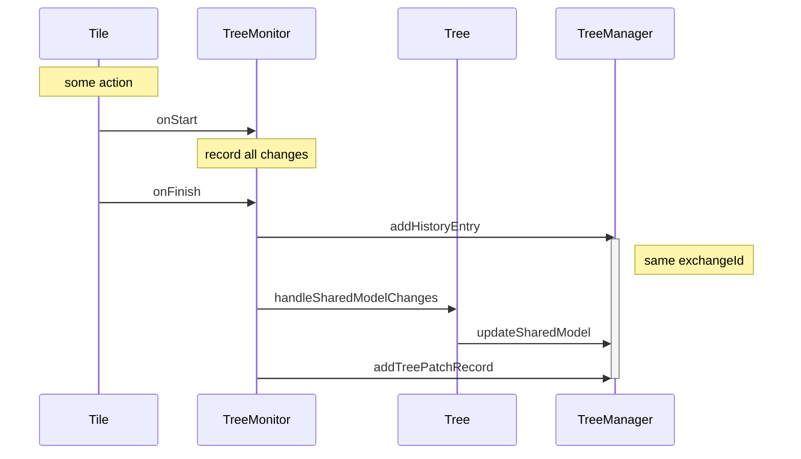
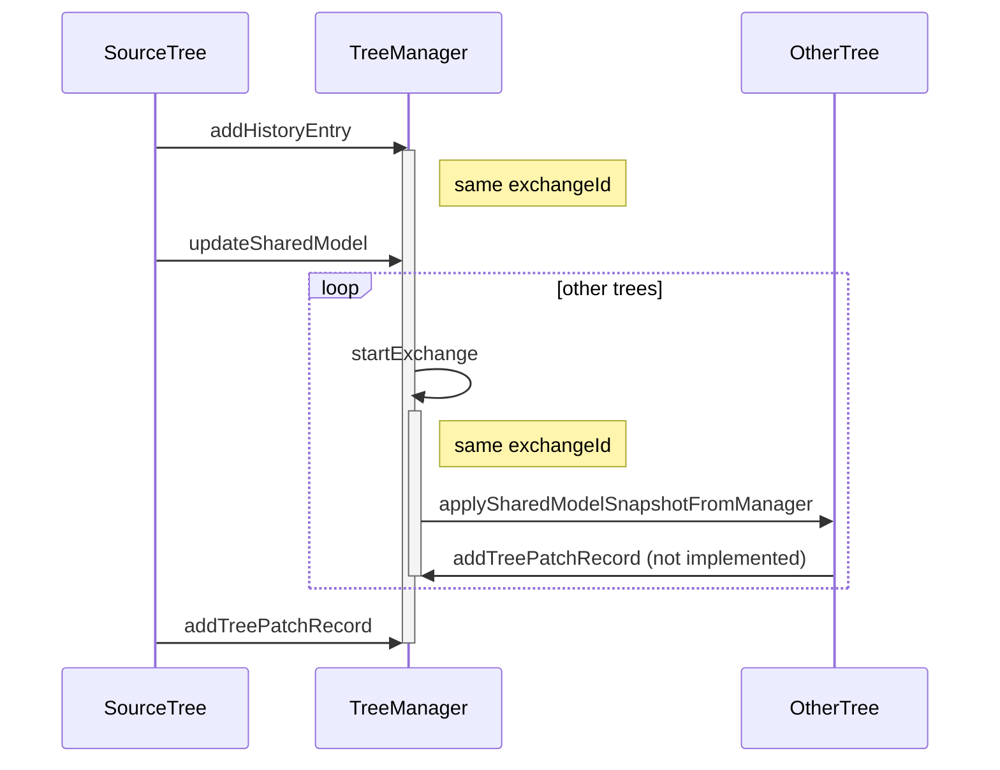

# History Framework

The history framework in CLUE is used for recording changes to documents to support undo/redo and time traveling.

The framework is based on MobX State Tree (MST). It is intended to support iframe based tile implementations. With iframe based tiles there will be multiple MST trees that need to coordinate with each other. However, we do not currently have any iframe tiles, so this capability of the system hasn't been tested yet.

The main parts of the system are:
- `TreeAPI`: this is the interface used by the TreeManager to work with the trees. It is intended to work over postMessage. Its methods are well documented.
- `TreeManagerAPI`: this is the interface used by trees to work with the TreeManager. It is intended to work over postMessage so trees in iframes can communicate with the TreeManager in the host page. Its methods are well documented.

- `TreePatchRecord`(MST): This is set of patches for a single tree. It represents what the MST action tracking middleware returns (action, patches, inversePatches)
- `HistoryEntry`(MST): This is a container of TreePatchRecords. It represents the full action which could be modifying multiple trees. It also keeps track of whether there are outstanding tree patch records that haven't been recorded yet.
- `CDocument`(MST): (change document) This has the list of history entries. It can be serialized independently to record the history of changes to the document.
- `UndoStore`(MST): This has a list of references to history entries as well as the index of the current entry that has been undone.  It would normally not be serialized itself. It uses references so we aren't keeping 2 copies of each history entry. It has actions to apply the undo and redo by applying patches to the affected trees.
- `TreeManager`(MST): This contains a CDocument and an UndoStore. It also tracks the set of trees. It implements the TreeManagerAPI.

- `Document`(MST): this creates the TreeManager in afterCreate, and stores it in its volatile prop.  It sets up the tree monitor with the Document, and TreeManagerAPI. It also adds itself as a tree to the TreeManager's array of trees. This is the main entry point to the history system. It is also the MST object that is serialized as the CLUE user document. It is not great that the Document is a tree and also initializes the TreeManager which is managing trees. 
- `Tree`(MST): a MST model that Document extends. It provides actions that Trees need. It is providing the implementation of the TreeAPI. It is intended to be generic and usable by any MST model that wants to be a tree. However currently it has references to DocumentContentModel, Tiles, and SharedModel. The worst of this is the DocumentContentModel. The idea would be that a iframe based tile would have a different root instead of DocumentContentModel and this root would include the Tree. So if the Tree had some view to get the sharedModelMap this would then be implemented by each root.
- `TreeMonitor`: a class which adds a MST middleware for recording actions.

## MST Models to store History and Undo

## Connection of History to CLUE Document

## Undo, Redo, Replay History

### From the tree's point of view

### From the TreeManager point of view

## Recording a change to a tile and shared model

### From the Tree's point of view
This is usually triggered when an action is called on a tile.

### From the TreeManager's point of view

## Serialization
We store the history of changes to a document in Firestore. Each history entry is stored in a separate Firestore document. These history entry documents are stored in the same way that comments are stored. There is a parent Firestore document that has meta data about the actual CLUE document and then under this parent Firestore document is a collection for the comments and a collection for the history entries.

The history entries are sent up by the TreeManager which is an MST model. In other places we interact with Firestore through react components so we can use hooks. Since we are in the model we just work directly with Firestore.

The history events are downloaded only when needed for replaying the history. This is done by a mostly invisible `<LoadDocumentHistory>` component. It currently puts up an ugly message on the screen to let the user know something is happening. This component uses hooks to load in the history and then update the document with this history. It is kind of strange for a React component to be managing the MST model. But this temporary history MST model is being created by the component only as it is needed, it isn't something shared by multiple components.

The history loading currently doesn't do any batching/paging during the load, so if the history gets large enough this might cause problems. There is a FIXME in the code for this. The component is currently monitoring Firestore collection, so if new history events are added they will be shown immediately without having to close and open the history UI. It isn't totally clear how these incremental history entries are handled. I think the `LoadDocumentHistory` component is re-rendered when new events show up and then the history in the TreeManager gets completely replaced with the updated history. In other words the entries aren't really loaded incrementally. We'll probably need to improve this to handle documents with large histories.

To create the parent document which contains the history entires in Firestore the TreeManager is using out Firebase function `validateCommentableDocument`. This can create either a document associated with a networked teacher or a generic user document. When we tackle handling permissions this document will be required to grant students and teachers access to the history entries of this document.

### Ordering of history entries

Currently we are using a Firestore server timestamp. This isn't great because the history entries do not always arrive at firestore in the same order that they are created. In particular the first history entry is waiting for the `validateCommentableDocument` to return before being added. The next history entries just check for the existence of the document and if they find it, they are added right away. This can result in the history entries being added out of order. Below are some options for addressing this.

#### Ordering entries based on linked list approach

Store the previous entry's id in the current entry (`previousEntryId`). The first entry will have an undefined previous entry.
Also store a server timestamp.
The query from firestore can order by the server timestamp so the entries are roughly in the right order.

To build the correct order efficiently we can do two passes through the results.

##### Pass 1
First create a map with a type of `{ [entryId] : { entry, nextEntryId }, ...}`.
Now go through the results. For each entry result:
- add it to the entry value of map, if there is a nextEntryId don't change it
- take the current entry's `previousEntryId` look this up in the map and add `nextEntryId` to it with this `previousEntryId` value
- if there is no `previousEntryId` save this entry as the first entry
- if the `previousEntryId` already has a different `nextEntryId` it means the history has been corrupted by two or more users writing to history at the same time. Show a warning.

##### Pass 2
Create a empty array of the history entries.
Start at the first entry, add it to the array.
Lookup its nextEntryId in the map. 
Add this to the array and keep going until you reach an object in the map with no nextEntryId
To be safe you can use a counter and don't iterate more than the total size of the results. This would prevent infinite loops if there was corrupt data.

##### Storing requirements
On the start of recording each session we need to know the entry id of the last history entry. So to be safe we have to download all the history entries to find the last one. We could cheat and reverse order the events by the server timestamp and then just look at the last X events. This assumes any out of order entries would be close to each other in time so we don't need to look far back in time to figure this out.

##### Problems
As described above, to be safe we have to look at every entry at the beginning of a new session with the document in order to figure out what the previousEntryId should be for the first entry of that session.

Possibly this lookup could be done asynchronously. Just the first entry of the session needs to know this, any future entries can refer to this first entry. But still to be safe all of the entries of the last session need to be downloaded. And this could be a large amount of data.

#### Ordering entries based on an index

Store the index of the entry. The first entry will have an index of 0.

To build the correct order we just request the entries from firestore ordered by this index.

##### Storing requirements
On the start of recording each session we need to know the entry index of the last history entry. This can be found by doing a query with a limit of one sorted by the index in reverse. This would just download the last entry saved.

All entries being written would have to wait for this lookup to occur before they will know their index.

##### Problems
If multiple users are editing the same document there can be entries with the same index. We can  mitigate this by storing a previousEntryId in each entry. We will know the last entry of the last session because we looked it up to find its index. Even if the sessions start out of order, at some point there will be two entries that have the same previousEntryId (and probably the same index).

It will be a little complicated to block the writing of new entries until they know their offset from the last entry of the last session.

#### Session start id plus index
Create a CLUE document session record (Firestore document) at the beginning of working with each CLUE document. Store the history entries under this documentSession document with an index for the session. 
The documentSession document would have a server timestamp that can be used to order them.

We load all of the documentSession documents ordered by the serverTimestamp and their children history entries. 

If the id of the documentSession is generated client side then the history entries don't need to wait.

##### Problems
We don't really know about overlapping entries here. 2 sessions could be active at the same time. The entries could include a server timestamp so we'd have a sense of this. We might be able to update the sessionDocument with an ending timestamp when the user closes the document, but that probably won't be reliable, since a network failure can break it.

If one session is started, closed and other started very quickly the sessionDocument timestamps might be out of order.

##### Benefits
No waiting at the beginning of a session for a round trip to Firestore.
Order of entries is in firestore 

#### Other Notes

We could use local computer timestamps to avoid the problem out of order events, but these are not accurate and in some schools can be years off.

There might be an approach that does the "Session start id plus index" without using extra documents by putting this start time or id in each of the history entry documents.

We could also put some session info the parent document itself, like a `numberOfSessions` to the document. So then a session index could be added to each history entry document. Then the history entry events could be ordered by the combination of this session index and a history entry index. 

An alternative to querying the entries for the last index would be to store the last history entry in the parent document, but this means that document have to be updated with each new entry. And there is a limit of 1 sec per update. If you want to look into that approach more see:
https://firebase.google.com/docs/firestore/solutions/aggregation

### Serialization TODO:
- [ ] See if we can remove this use of cloud functions to do the network document writes, I think the only reason to use them is for permissions, I'd guess we can create rules that would allow them to be written without the functions. We probably are going to have either do this or change the cloud function so it can support students creating parent documents.
- [ ] fix ordering issue, currently we are using a server timestamp which gets out of order when the first entry is delayed as the document parent is fetched. The right approach I think is to store the last index in the document and then on each session load this index and start from there. This last index will also be useful when dealing with publishing documents.
- [ ] add access rules so authenticated students can write the parent document and the history entries
- [ ] add access rules so authenticated teachers can read the student created parent document and history entries
- [ ] add tests for the new access rules
- [ ] add tests for serializing the history, I'm not sure a good way to do this in Jest, so this will probably be cypress based
- [ ] update the logic for enabling the history button, so it checks the document's history index. This way it will only enable when the document has a history
- [ ] handle case when a teacher is viewing a history and new events are added. Previously we just didn't show the new entries until the history slider was opened and closed again. With the new serialized history, the new entries are being added in realtime. I think this breaks the slider code.
- [ ] refactor history hook code so it isn't located inside of the comment hooks file
- [ ] refactor mock firebase functions that is duplicated in 3 tests. If we switch to directly writing files then we'll probably have to mock that instead
- [ ] refactor history serialization code out of the tree-manager it is adding 100 lines to an already large file
- [ ] refactor history serialization's access to the user info which it uses to know where to write the history. This user info is set statically and not updated. Everywhere else in the code this info is dynamically updated, which makes it possible for the user to be switched (or logged out) without refreshing the page.
- [ ] How do we handle the caching of this data? Each time we open the time travel slider we are currently copying the document and all of the history events. We could just load all of these history events from the database each time it is opened. I would guess that Firestore does some caching of these queries so it won't be too slow as long as we share the firestore connection object.
- [ ] Handle published documents. We either need to copy and modify all of the history entries, or we need to change clue so the copies do not change the tile ids. In either case there are more details to fill out here.

## General TODO:
- [ ] UndoStore.redo and UndoStore.undo do not handle async well, they are changing the undo index before all of the patches have been applied to the trees.
- [ ] review how exchangeId is handled when an undo triggers a call to updateSharedModel, should a new exchangeId be generated here or should it be re-using an existing exchangeId?
- [ ] try to unify Document.afterCreate with createDocument
- [ ] move some of the large comments in the code into this document and put references in the code.
