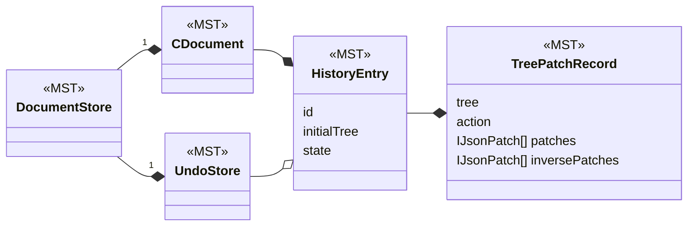
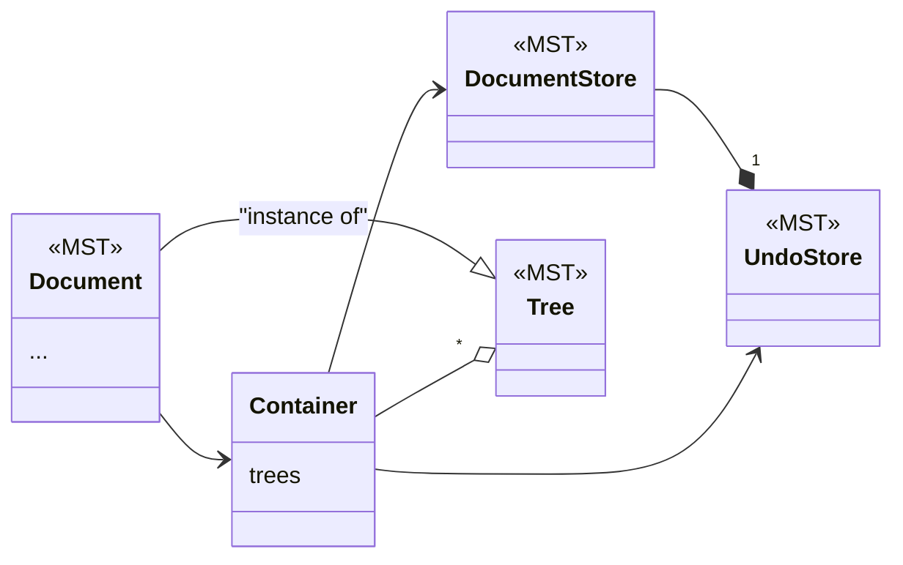

# History Framework

The history framework in CLUE is used for recording changes to documents to support undo/redo and time traveling.

The framework is based on MobX State Tree (MST). It is intended to support iframe based tile implementations. We do not currently have any iframe tiles, but the key feature is that there has to be multiple MST trees that coordinate with each other.

The main parts of the system are:
- `TreeAPI`: this is the interface used by the container to work with the trees. It is intended to work over postMessage. Its methods are well documented.
- `ContainerAPI`: this is the interface used by trees to work with the container. It is intended to work over postMessage so trees in iframes can communicate with the container in the host page. Its methods are well documented.

- `TreePatchRecord`(MST): This is set of patches for a single tree. It represents what the MST action tracking middleware returns (action, patches, inversePatches)
- `HistoryEntry`(MST): This is a container of TreePatchRecords. It represents the full user or async action which could be modifying multiple trees. It also keeps track of whether there are outstanding tree patch records that haven't been recorded yet.
- `CDocument`(MST): (change document) This has the list of history entries. It can be serialized independently to record the history of changes to the document.
- `UndoStore`(MST): This has a list of references to history entries as well as the index of the current entry that has been undone.  It would normally not be serialized itself. It uses references so we aren't keeping 2 copies of each history entry. It has actions to apply the undo and redo by applying patches to the affected trees.
- `DocumentStore`(MST): This has a CDocument and a UndoStore.
- `Container`: the singleton that manages the multiple trees. It has one documentStore, undoStore, containerAPI, and array of trees. Because it isn't a MST model it can't own the undoStore otherwise it could.
FIXME: it sees like this could be simplified. Some merge of the DocumentStore and the Container seems worth while. The problem I can see is that the Container needs to implement or provide the containerAPI. Perhaps it could just implement it, and have the extra stuff of trees. This way we could get rid of the DocumentStore. Most of the methods just proxy to the document store anyhow.

- `Document`(MST): this creates the Container in afterCreate, and stores it in its volatile prop. It also separately stores the containerAPI. It setups up the tree monitor with the Document, and containerAPI. It also adds itself as a tree to the container's array of trees. This is the main entry point to the history system. It is also the MST object that is serialized as the CLUE user document. It is strange that the Document is a tree and also initializes the container. 
FIXME: I don't know why it needs both container and containerAPI. 
- `Tree`(MST): a MST model that Document extends. It provides actions that Trees need. It is providing the implementation of the TreeAPI. It is intended to be generic and usable by any MST model that wants to be a tree. However currently it has references to DocumentContentModel, Tiles, and SharedModel. The worst of this is the DocumentContentModel. The idea would be that a iframe based tile would have a different root instead of DocumentContentModel and this root would include the Tree. So if the Tree had some view to get the sharedModelMap this would then be implemented by each root.
- "tree monitor": a MST middleware which records the actions.

## MST Models to store History and Undo

## Connection of History to CLUE Document

TODO:
- [x] document history models
- [x] find or make tests of the existing code so we can address the FIXMEs without manually testing each one. These tests can be based on the shared-model-document-manager tests. We can start with testing undo and redo. We don't have time to test that it works with multiple trees through, so we'll start with the single tree. That should be enough to do the refactoring.
- [ ] rename callId and methods describing call: probably should be patchRecordId and startPatchRecord and endPatchRecord
- [ ] try to unify Document.afterCreate with createDocument
- [ ] review how callId is handled when an undo tiggers a call to updateSharedModel, should a new callId be generated here or should it be re-using an existing callId?
- [ ] can the historyEntryId be used as the callId? I think not, but it should be reviewed and documented.
- [ ] see if we can remove the code which creates a history entry when addPatchesToHistoryEntry is called
- [ ] look at the history entry generated when the history is replayed. The fixme is in the closeHistoryEntryCall. In the case of time travel we don't want to generate new history entries when they time travel. And we aren't currently planning to replay the history from scratch. So if it is easy we should get rid of any history entry generation when replaying. The test for replaying does have the tree monitor installed when the history is replayed so it is a way to test whether we can skip this.
- [ ] add a test where a new shared model is added to the document and see what history entries are generated and whether the updateSharedModel methods are called correctly. I haven't really thought about what should happen here. fixmes are in tree-monitor recordPatches
- [ ] Tree.handleSharedModelChanges is an async action that ins't a flow. There might also be a way to simplify it now that it is an action.
- [ ] Tree.handleSharedModelChanges calls updateTreeAfterSharedModelChangesInternal but since it is async and not a flow this call becomes a new top level action. If we switch it to a flow then we'll probably have to ignore the handleSharedModelChanges in the tree-monitor
- [ ] UndoStore.redo and UndoStore.undo do not handle async well, they are changing the undo index before all of the patches have been applied to the trees.
- [ ] review call to updateAfterSharedModelChanges in shared-model-document-manager.addTileSharedModel. Is it necessary?
