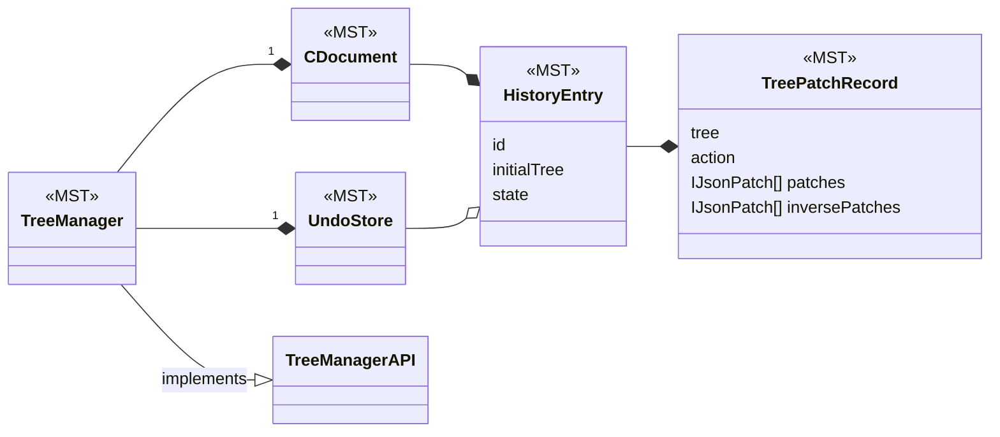
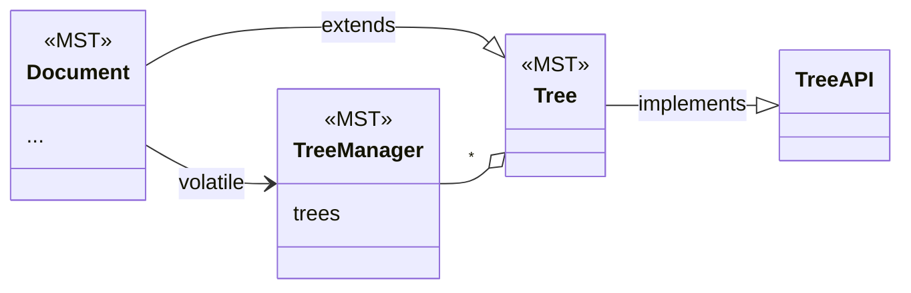
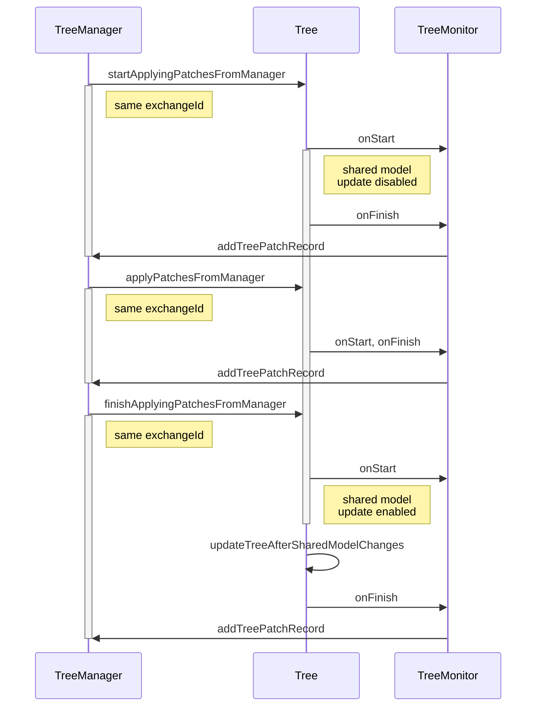
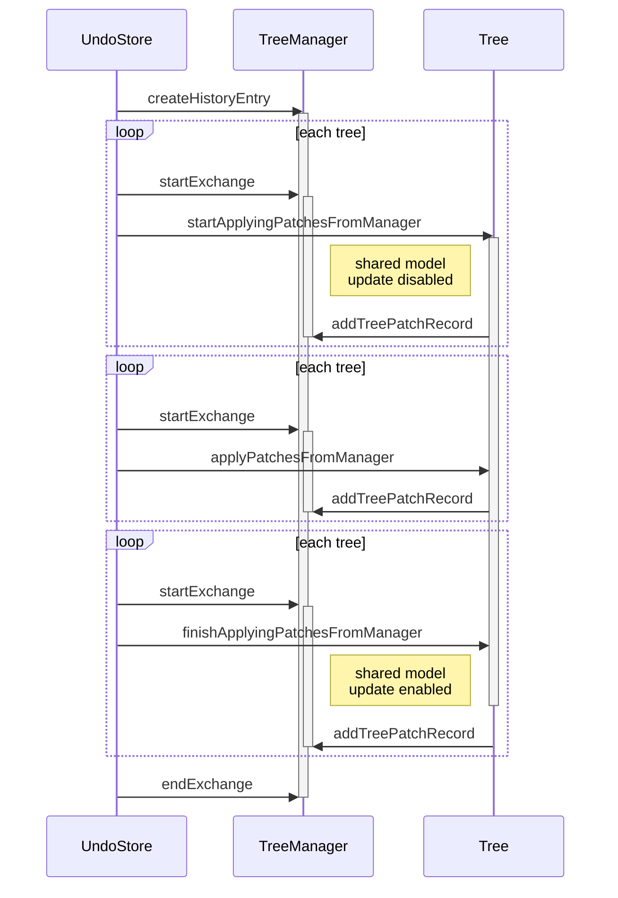
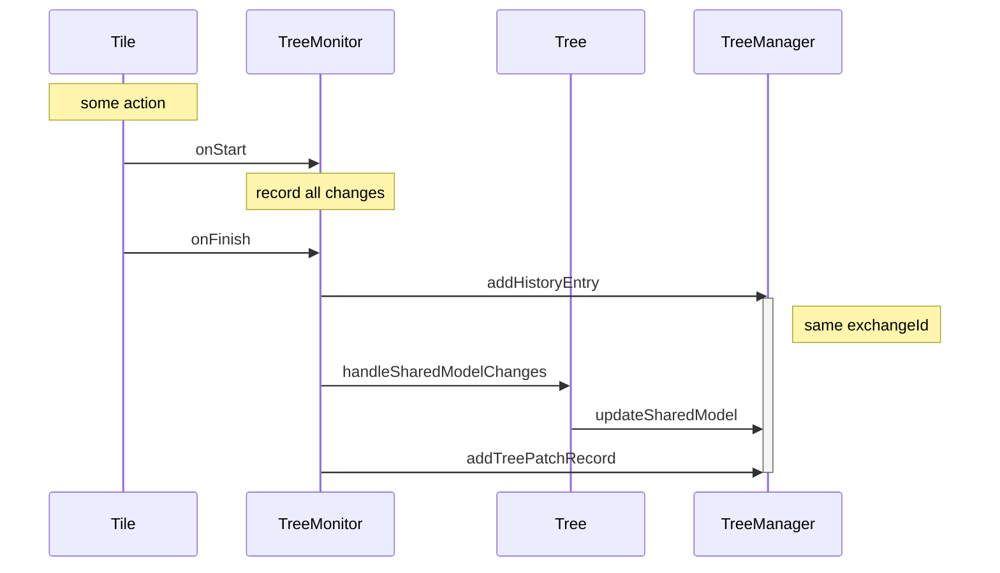
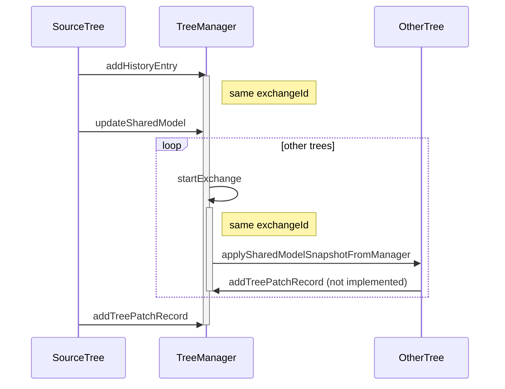

# History Framework

The history framework in CLUE is used for recording changes to documents to support undo/redo and time traveling.

The framework is based on MobX State Tree (MST). It is intended to support iframe based tile implementations. With iframe based tiles there will be multiple MST trees that need to coordinate with each other. However, we do not currently have any iframe tiles, so this capability of the system hasn't been tested yet.

The main parts of the system are:
- `TreeAPI`: this is the interface used by the TreeManager to work with the trees. It is intended to work over postMessage. Its methods are well documented.
- `TreeManagerAPI`: this is the interface used by trees to work with the TreeManager. It is intended to work over postMessage so trees in iframes can communicate with the TreeManager in the host page. Its methods are well documented.

- `TreePatchRecord`(MST): This is set of patches for a single tree. It represents what the MST action tracking middleware returns (action, patches, inversePatches)
- `HistoryEntry`(MST): This is a container of TreePatchRecords. It represents the full action which could be modifying multiple trees. It also keeps track of whether there are outstanding tree patch records that haven't been recorded yet.
- `CDocument`(MST): (change document) This has the list of history entries. It can be serialized independently to record the history of changes to the document.
- `UndoStore`(MST): This has a list of references to history entries as well as the index of the current entry that has been undone.  It would normally not be serialized itself. It uses references so we aren't keeping 2 copies of each history entry. It has actions to apply the undo and redo by applying patches to the affected trees.
- `TreeManager`(MST): This contains a CDocument and an UndoStore. It also tracks the set of trees. It implements the TreeManagerAPI.

- `Document`(MST): this creates the TreeManager in afterCreate, and stores it in its volatile prop.  It sets up the tree monitor with the Document, and TreeManagerAPI. It also adds itself as a tree to the TreeManager's array of trees. This is the main entry point to the history system. It is also the MST object that is serialized as the CLUE user document. It is not great that the Document is a tree and also initializes the TreeManager which is managing trees. 
- `Tree`(MST): a MST model that Document extends. It provides actions that Trees need. It is providing the implementation of the TreeAPI. It is intended to be generic and usable by any MST model that wants to be a tree. However currently it has references to DocumentContentModel, Tiles, and SharedModel. The worst of this is the DocumentContentModel. The idea would be that a iframe based tile would have a different root instead of DocumentContentModel and this root would include the Tree. So if the Tree had some view to get the sharedModelMap this would then be implemented by each root.
- `TreeMonitor`: a class which adds a MST middleware for recording actions.

## MST Models to store History and Undo


## Connection of History to CLUE Document


## Undo, Redo, Replay History

### From the tree's point of view


### From the TreeManager point of view



## Recording a change to a tile and shared model

### From the Tree's point of view
This is usually triggered when an action is called on a tile.


### From the TreeManager's point of view


## Serialization
We want to store the history in firestore in documents. There is already a pattern for storing firestore documents associated with a CLUE document. This is used by the comment system.

Other places that are interacting with the CLUE database are using react-query to manage the requests, I'm not sure if we need it in this case.

We could send the data to firestore when the event is complete and stored in the history. This could be done as a hook on the history MST model. Or it could just be hardcoded into the history model. Or it could be done done as a middleware of some kind.

This sending of data from the model is different than in other cases where the data is sent via components which works nicely with react-query.

To retrieve the data we'd want to only load it when necessary. Currently this is when the time travel UI is opened on a document. We could pre-fetch it to speed things up. But initially we could just load it when that is opened.

Loading the data would require a query for all of the documents in firestore that matched the specific CLUE document being viewed. This should be similar to the query requesting the comments for this document. In this case maybe react-query would make sense because maybe that is how comments are handled? However since this is firestore react query seems unnecessary firestore should take care of retries and syncing local and remote state.

When we get the data we'd need to populate the history MST model with this data. So if the view is rendering the history UI it needs to know when this data is being fetched and when it is complete so it can update the view correctly. We could put that state in the history MST model as volatile. Or we could use react-query for it.  If we can follow the comment pattern here that is probably best. But it is strange for the component to be mananging the popluation of the history MST model. But this history MST model is essentially managed by the component anyway because it creates the temporary document with the history state.

Seems like the best approach for loading is to add a hidden react component that uses `useCollectionOrderedRealTimeQuery` to load the history documents. And then as they are loaded they get put into the history MST model. I'm not sure about the ordering of these history documents but it seems like that could work. It would still be better to use an ordered map of these docs in MST so new ones could be batch "applied" without recreating the whole array. However I'm not sure how the ordering of Maps works in MST.

From what I can tell the MST maps are basically ES6 Maps which remember their insertion order. So we can order them that way. However we can't just add documents coming out of order from Friestore to this map since they will be out of order. So the ordering of the map will have to managed carefully.

Seems like a good path to use is.
```
`documents/${docKey}/historyEntries`
```
useCollectionOrderedRealTimeQuery takes care of making that path relative to the right scope.

To post the data we need to have a document to hang it off of. It looks like I can use `useCommentableDocument` but it might not work for students since I think it was only used for teachers.  This calls a cloud function to create the document in firestore. But the problem is that all of these things are written as hooks, so I can't call them from the MST model when the histry event is saved.

After the document is created, we should be able to use firestore commands to upload the history entries without having to add another cloud function to handle this.

The authentication rules will need to be updated.

### Ordering of history entries

Currently we are using a Firestore server timestamp. This isn't great because it isn't clear if the history entries will arrive at firestore in the same order that they are created. So they might be out of order. It might be better to maintain a lastHistoryIndex or historyLength property on the document. And then update it using a transaction at the same time the new history entry is written. 

We aren't doing that right now because the way this top level document is managed will probably change when we support student documents. 

Another alternative would be to use a session start data and then append a index after that. This way we are only relying on the date for the initial startup and then after that individual entries are ordered just based on local counting. This would not handle the case of multiple editors at the same time, but that is not a case we are currently supporting anyway.

New ideas:
- add a numberOfSessions to the document. save the current value of this when the document is opened and then increment it. Now use the saved value a long with a local timestamp or incrementing index to order the events. This way the document doesn't have to be updated on each event.
- in each event include the id of the previous event and also save the server timestamps. Then re-order the events after we download them all. This will require some slow scanning through all events to re-order them. Even if we don't use this information for ordering at the runtime it seems useful to record it so we can more easily identify out of order events.
- save a index on each event then do a query which orders the events in reverse and limits the result to the last 1. This should get us the last event document and then we can use its index. I'd expect this to be pretty fast. However it would still suffer from the timing issue, if the first entry was trying to find out this index future entries would need to be chained off of this, so they get ordered correctly.

### Serialization TODO:
- [x] Figure out why my use of validate is not sending the right userContext. When posting comments the right userContext is sent, but not when sending validate.
- [x] Consider removing the validate call because it is never actually called. I left a comment in the code and will leave it at that for now.
- [x] Figure out why the documents written with the post have a different id than what I'm creating directly
- [x] Look at the rules to see how they are currently validating access to the comments. It is looking at the teachers of the parent document and the requesting teacher has to be in that list. Or the document has to have a network that is one of the teachers networks. This seems redundant to have networks as well as list of teachers on documents. I'm guessing that the network approach is the more modern one.
- [x] Track down how the comments load. I remember they are not using MST, but I think they are using react-query and probably react state to store the comments from react-query. They call `useDocumentComments` which calls a generic `useCollectionOrderedRealTimeQuery` which can work with any firestore collection.
- [x] add an order to the history entries that are stored in firestore so we can pull them out in the correct order. The trick here is that they are currently a direct copy of the history entries from MST, so that doesn't need an explict order field. So I guess the code that is storing these docs in firestore needs to be updated to add this field.
- [x] make a hidden component that loads in the history into the CLUE document that is created when the history UI is opened. I think this hidden component can be added at this history opening location.
- [ ] save student history entries to firestore, need to make a parent document for these entries, we could start with the same approach we use for teacher documents
- [ ] add way for teachers to find the student history entries, perhaps this will just work, but we'll need to construct the id of the parent document. Also update the history control in the dashboard to actually work.
- [ ] See if we can remove this use of cloud functions to do the network document writes, I think the only reason to use them is for permissions, I'd guess we can create rules that would allow them to be written without the functions. We probably are going to have either do this or change the cloud function so it can support students creating parent documents.
- [ ] fix ordering issue, currently we are using a server timestamp which gets out of order when the first entry is delayed as the document parent is fetched. The right approach I think is to store the last index in the document and then on each session load this index and start from there. This last index will also be useful when dealing with publishing documents.
- [ ] add access rules so authenticated students can write the parent document and the history entries
- [ ] add access rules so authenticated teachers can read the student created parent document and history entries
- [ ] add tests for the new access rules
- [ ] add tests for serializing the history, I'm not sure a good way to do this in Jest, so this will probably be cypress based
- [ ] update the logic for enabling the history button, so it checks the document's history index. This way it will only enable when the document has a history
- [ ] handle case when a teacher is viewing a history and new events are added. Previously we just didn't show the new entries until the history slider was opened and closed again. With the new serialized history, the new entries are being added in realtime. I think this breaks the slider code.
- [ ] refactor history hook code so it isn't located inside of the comment hooks file
- [ ] refactor mock firebase functions that is duplicated in 3 tests. If we switch to directly writing files then we'll probably have to mock that instead
- [ ] refactor history serialization code out of the tree-manager it is adding 100 lines to an already large file
- [ ] refactor history serialization's access to the user info which it uses to know where to write the history. This user info is set statically and not updated. Everywhere else in the code this info is dynamically updated, which makes it possible for the user to be switched (or logged out) without refreshing the page.
- [ ] How do we handle the caching of this data? Each time we open the time travel slider we are currently copying the document and all of the history events. We could just load all of these history events from the database each time it is opened. I would guess that Firestore does some caching of these queries so it won't be too slow as long as we share the firestore connection object.
- [ ] Handle published documents. We either need to copy and modify all of the history entries, or we need to change clue so the copies do not change the tile ids. In either case there are more details to fill out here.


## General TODO:
- [ ] UndoStore.redo and UndoStore.undo do not handle async well, they are changing the undo index before all of the patches have been applied to the trees.
- [ ] review how exchangeId is handled when an undo triggers a call to updateSharedModel, should a new exchangeId be generated here or should it be re-using an existing exchangeId?
- [ ] try to unify Document.afterCreate with createDocument
- [ ] move some of the large comments in the code into this document and put references in the code.
