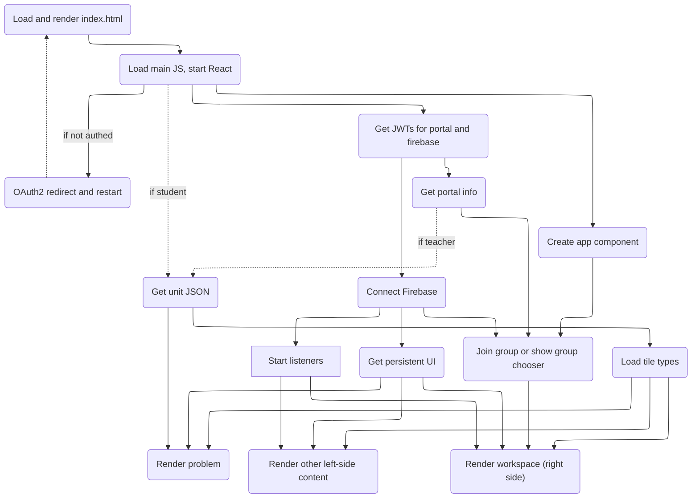

# Simplified sequence

This diagram is somewhat abstract, showing only things that conceptually need to be complete before other steps can move forward.  Some boxes are represent multiple concurrent events. Examples are "JWTs for portal and firebase" and "Start listeners".

