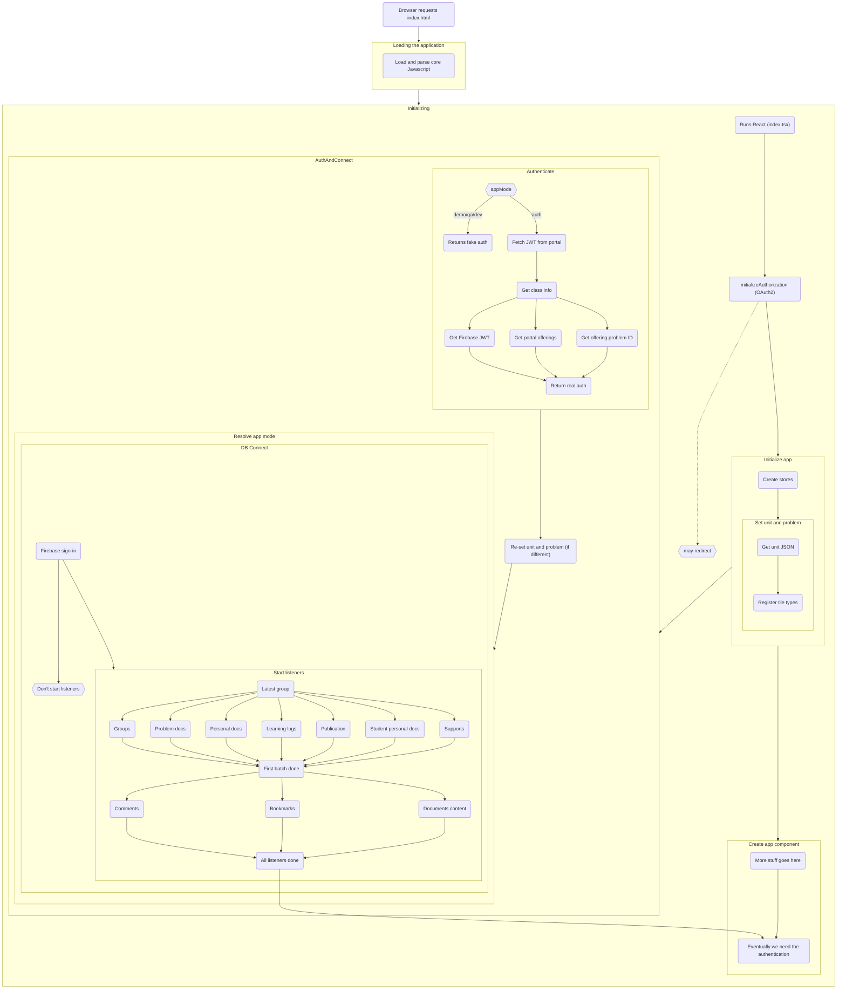

# CLUE Startup sequence

```mermaid
flowchart TD
  req(Browser requests index.html)
  req --> load

  subgraph load [Loading the application]
    direction TB
    parse(Load and parse core Javascript)
  end
  load --> init

  subgraph init [Initializing]
    direction TB
    indextsx("Runs React (index.tsx)")
    indextsx --> ia
    ia("initializeAuthorization (OAuth2)")
    ia -.-> restart{{may redirect}}
    ia --> initapp
    subgraph initapp [Initialize app]
      direction TB
      cs(Create stores)
      cs --> sup
      subgraph sup [Set unit and problem]
        direction TB
        guj(Get unit JSON)
        guj --> rtt
        rtt(Register tile types)
      end
    end

    initapp --> component
    initapp --> auth

    subgraph auth [AuthAndConnect]
      direction TB

      subgraph authenticate [Authenticate]
        direction TB
        type{{appMode}}
        type -- demo/qa/dev --> demo
        type -- auth --> real1
        demo(Returns fake auth)
        real1(Fetch JWT from portal) --> real2(Get class info)
        real3(Get Firebase JWT)
        real4(Get portal offerings)
        real5(Get offering problem ID)
        real2 --> real3 & real4 & real5 --> real6
        real6(Return real auth)
      end

      authenticate --> sup2
      sup2("Re-set unit and problem (if different)")

      subgraph ram [Resolve app mode]
        direction TB

        subgraph db [DB Connect]
          direction TB
          fb(Firebase sign-in)
          fb --> nolisteners & listeners
          nolisteners{{Don't start listeners}}
          subgraph listeners [Start listeners]
            direction TB
            lgroup(Latest group)
            group(Groups)
            prob(Problem docs)
            pers(Personal docs )
            ll(Learning logs )
            pub(Publication )
            spd(Student personal docs )
            supl(Supports )
            lgroup --> group & prob & pers & ll & pub & spd & supl --> next
            next(First batch done)

            com(Comments )
            bm(Bookmarks )
            dc(Documents content )
            next --> com & bm & dc --> finish
            finish(All listeners done)
          end
        end
      end
      sup2 --> ram
    end

    subgraph component [Create app component]
      direction TB

      more(More stuff goes here)
      more --> even
      finish --> even
      even(Eventually we need the authentication)
    end


  end


```

