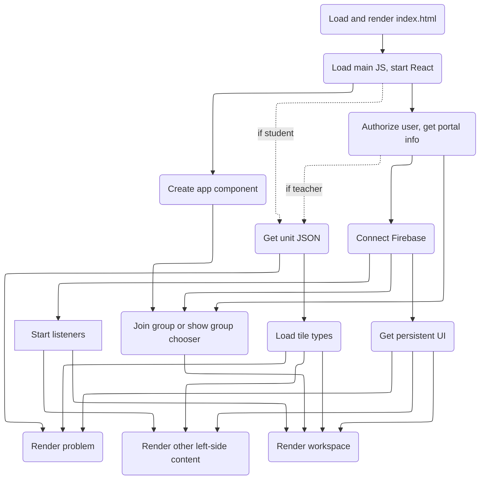

# CLUE Startup sequence

## Simplified sequence

This diagram is somewhat abstract, showing only things that conceptually need to be complete
before other steps can move forward.



## Current Loading sequence

```mermaid
flowchart TD
  req(Browser requests index.html)
  req --> load

  style load fill:#220000
  subgraph load [LE: Loading the application]
    direction TB
    parse(Load and parse core Javascript)
  end
  load --> init

  classDef loadingEvent fill:#220000
  class init loadingEvent
  subgraph init [LE: Initializing]
    direction TB
    indextsx("Runs React (index.tsx)")
    indextsx --> ia
    ia("initializeAuthorization (OAuth2)")
    ia -.-> restart{{may redirect}}
    ia --> initapp
    subgraph initapp [Initialize app]
      direction TB
      cs(Create stores)
    end

    initapp --> component("Create app component")

  end

  initapp --> sup
  subgraph sup [Set unit and problem]
    direction TB
    style loadingCurriculumContent fill:#220000
    subgraph loadingCurriculumContent [LE: Loading curriculum content]
      unit(Get unit JSON)
    end
    unit --> tiles
    style settingUpCurriculumContent fill:#220000
    subgraph settingUpCurriculumContent [LE: Setting up curriculum content]
      style loadingTileTypes fill:#220000
      subgraph loadingTileTypes [LE: Loading tile types]
        tiles(Register tile types)
      end
      configStores(Configure some stores)
      loadingTileTypes --> configStores
    end
  end

  component --> auth
  component --> renderApp

  style connecting fill:#220000
  subgraph connecting [LE: Connecting]
    subgraph auth [AuthAndConnect]
      direction TB

      subgraph authenticate [Authenticate]
        direction TB
        type{{appMode}}
        type -- demo/qa/dev --> demo
        type -- auth --> real1
        demo(Returns fake auth)
        real1(Fetch JWT from portal) --> real2(Get class info)
        real3(Get Firebase JWT)
        real4(Get portal offerings)
        real5(Get offering problem ID)
        real2 --> real3 & real4 & real5 --> real6
        real6(Return real auth)
      end

      authenticate --> sup2
      sup2("Re-set unit and problem (if different)")

      subgraph ram [Resolve app mode]
        direction TB

        subgraph db [DB Connect]
          direction TB
          fb(Firebase sign-in)
          fb --> nolisteners & listeners
          nolisteners{{Don't start listeners}}
          subgraph listeners [Start listeners]
            direction TB
            lgroup(Latest group)
            group(Groups)
            prob(Problem docs)
            pers(Personal docs )
            ll(Learning logs )
            pub(Publication )
            spd(Student personal docs )
            supl(Supports )
            lgroup --> group & prob & pers & ll & pub & spd & supl --> next
            next(First batch done)

            com(Comments )
            bm(Bookmarks )
            dc(Documents content )
            next --> com & bm & dc --> finish
            finish(All listeners done)
          end
        end
      end
      sup2 --> ram

      style loadingCurrentActivity fill:#220000
      subgraph loadingCurrentActivity [LE: Loading current activity]
        initializePersistentUISync
      end
      ram --> initializePersistentUISync


    end
  end
  sup --> listeners
  sup --> sup2

  style joiningGroup fill:#220000
  subgraph joiningGroup [LE: Joining group]
    renderGroupChooser
  end
  renderApp --> renderGroupChooser
  finish --> renderGroupChooser

  renderAppContentComponent
  renderGroupChooser --> renderAppContentComponent

  primaryDocumentLoaded
  finish --> primaryDocumentLoaded

  style buildingWorkspace fill:#220000
  subgraph buildingWorkspace [LE: Building workspace]
    RDWCC(show the real right side content)
  end
  renderAppContentComponent --> RDWCC
  primaryDocumentLoaded --> RDWCC


```



## Previous Loading sequence

```mermaid
flowchart TD
  req(Browser requests index.html)
  req --> load

  style load fill:#220000
  subgraph load [LE: Loading the application]
    direction TB
    parse(Load and parse core Javascript)
  end
  load --> init

  classDef loadingEvent fill:#220000
  class init loadingEvent
  subgraph init [LE: Initializing]
    direction TB
    indextsx("Runs React (index.tsx)")
    indextsx --> ia
    ia("initializeAuthorization (OAuth2)")
    ia -.-> restart{{may redirect}}
    ia --> initapp
    subgraph initapp [Initialize app]
      direction TB
      cs(Create stores)
      cs --> sup
      subgraph sup [Set unit and problem]
        direction TB
        style loadingCurriculumContent fill:#220000
        subgraph loadingCurriculumContent [LE: Loading curriculum content]
          unit(Get unit JSON)
        end
        unit --> tiles
        style settingUpCurriculumContent fill:#220000
        subgraph settingUpCurriculumContent [LE: Setting up curriculum content]
          style loadingTileTypes fill:#220000
          subgraph loadingTileTypes [LE: Loading tile types]
            tiles(Register tile types)
          end
          configStores(Configure some stores)
          loadingTileTypes --> configStores
        end
      end
    end

    initapp --> component("Create app component")

  end

  component --> auth
  component --> renderApp

  style connecting fill:#220000
  subgraph connecting [LE: Connecting]
    subgraph auth [AuthAndConnect]
      direction TB

      subgraph authenticate [Authenticate]
        direction TB
        type{{appMode}}
        type -- demo/qa/dev --> demo
        type -- auth --> real1
        demo(Returns fake auth)
        real1(Fetch JWT from portal) --> real2(Get class info)
        real3(Get Firebase JWT)
        real4(Get portal offerings)
        real5(Get offering problem ID)
        real2 --> real3 & real4 & real5 --> real6
        real6(Return real auth)
      end

      authenticate --> sup2
      sup2("Re-set unit and problem (if different)")

      subgraph ram [Resolve app mode]
        direction TB

        subgraph db [DB Connect]
          direction TB
          fb(Firebase sign-in)
          fb --> nolisteners & listeners
          nolisteners{{Don't start listeners}}
          subgraph listeners [Start listeners]
            direction TB
            lgroup(Latest group)
            group(Groups)
            prob(Problem docs)
            pers(Personal docs )
            ll(Learning logs )
            pub(Publication )
            spd(Student personal docs )
            supl(Supports )
            lgroup --> group & prob & pers & ll & pub & spd & supl --> next
            next(First batch done)

            com(Comments )
            bm(Bookmarks )
            dc(Documents content )
            next --> com & bm & dc --> finish
            finish(All listeners done)
          end
        end
      end
      sup2 --> ram

      style loadingCurrentActivity fill:#220000
      subgraph loadingCurrentActivity [LE: Loading current activity]
        initializePersistentUISync(Initialize PersistentUISync)
      end
      ram --> initializePersistentUISync
    end
  end

  style joiningGroup fill:#220000
  subgraph joiningGroup [LE: Joining group]
    renderGroupChooser(Render group chooser)
  end
  renderApp --> renderGroupChooser


```
