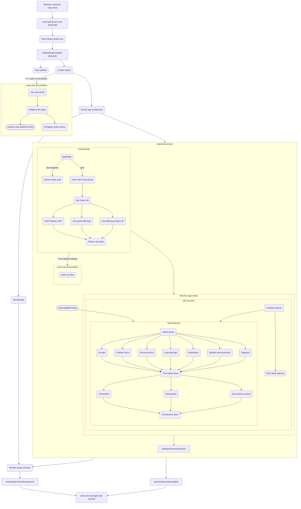

# CLUE Startup sequence

Look at the diagram source to see the loading events

```mermaid
flowchart TB

  req(Browser requests index.html)
  req --> parse

  %% LE.start: Loading the application
  parse(Load and parse core Javascript)
  parse --> indextsx
  %% LE.end: Loading the application

  %% LE.start: Initializing
  indextsx("Runs React (index.tsx)")
  indextsx --> ia
  ia("initializeAuthorization (OAuth2)")
  restart{{may redirect}}
  ia -.-> restart
  ia --> cs
  cs(Create stores)
  %% LE.end: Initializing

  component("Create app component")
  cs --> component

  cs -- if != auth or unit param --> loadUnitProblem
  subgraph loadUnitProblem [Load unit and problem]
    direction TB

    %% LE.start: Loading curriculum content
    unit(Get unit JSON)
    %% LE.end: Loading curriculum content

    unit --> tiles

    %% LE.start: Setting up curriculum content
    %% LE.start: Loading tile types
    tiles(Register tile types)
    %% LE.end: Loading tile types

    resolveUnitLoadedPromise([resolve unitLoadedPromise])
    tiles --> resolveUnitLoadedPromise

    configStores(Configure some stores)
    tiles --> configStores
    %% LE.end: Setting up curriculum content
  end

  component --> auth
  component --> renderApp
  renderApp(RenderApp)

  %% LE.start: Connecting
  subgraph auth [AuthAndConnect]
    direction TB

    unitLoadedPromise([unitLoadedPromise])

    subgraph authenticate [Authenticate]
      direction TB
      type{{appMode}}
      type -- demo/qa/dev --> demo
      type -- auth --> real1
      demo(Returns fake auth)
      real1(Fetch JWT from portal) --> real2(Get class info)
      real3(Get Firebase JWT)
      real4(Get portal offerings)
      real5(Get offering problem ID)
      real2 --> real3 & real4 & real5 --> real6
      real6(Return real auth)
    end

    subgraph loadUnitProblemRef [Load unit and problem]
      direction TB
      label{{same as other}}
    end

    authenticate -- if not started loading --> loadUnitProblemRef

    loadUnitProblemRef ~~~ unitLoadedPromise
    %%authenticate ~~~ unitLoadedPromise

    subgraph ram [Resolve app mode]
      direction TB

      subgraph db [DB Connect]
        direction TB
        fb(Firebase sign-in)
        fb --> nolisteners & listeners
        nolisteners{{Don't start listeners}}
        subgraph listeners [Start listeners]
          direction TB
          lgroup(Latest group)
          group(Groups)
          prob(Problem docs)
          pers(Personal docs)
          ll(Learning logs)
          pub(Publication)
          spd(Student personal docs)
          supl(Supports)
          lgroup --> group & prob & pers & ll & pub & spd & supl --> next
          next(First batch done)

          com(Comments)
          bm(Bookmarks)
          dc(Documents content)
          next --> com & bm & dc --> finish
          finish(All listeners done)
        end
      end
    end
    authenticate --> ram

    %% LE.start: Loading current activity
    initializePersistentUISync
    %% LE.end: Loading current activity

    ram --> initializePersistentUISync
    unitLoadedPromise --> listeners
  end
  %% LE.end: Connecting


  %% LE.start: Joining group
  renderGroupChooser(Render group chooser)
  %% LE.end: Joining group

  renderApp --> renderGroupChooser
  auth --> renderGroupChooser

  renderAppContentComponent
  renderGroupChooser --> renderAppContentComponent

  primaryDocumentLoaded
  auth --> primaryDocumentLoaded

  %% LE.start: Building workspace
  renderDocumentWorkspaceComponentContent(show the real right side content)
  %% LE.end: Building workspace

  renderAppContentComponent --> renderDocumentWorkspaceComponentContent
  primaryDocumentLoaded --> renderDocumentWorkspaceComponentContent

```
