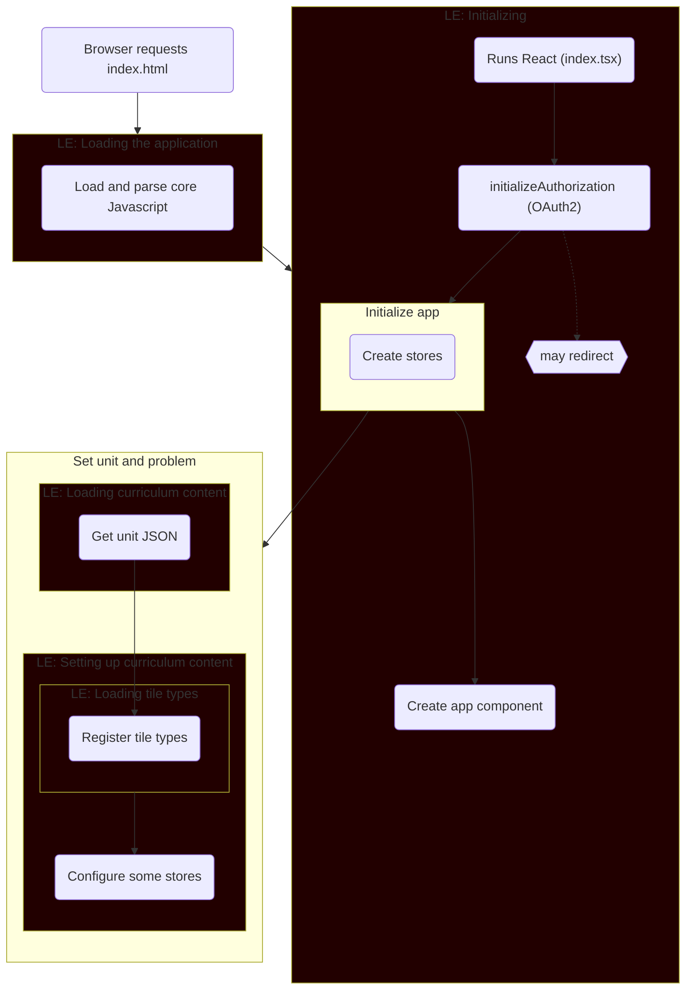

```mermaid
flowchart TD
  req(Browser requests index.html)
  req --> load

  style load fill:#220000
  subgraph load [LE: Loading the application]
    direction TB
    parse(Load and parse core Javascript)
  end
  load --> init

  classDef loadingEvent fill:#220000
  class init loadingEvent
  subgraph init [LE: Initializing]
    direction TB
    indextsx("Runs React (index.tsx)")
    indextsx --> ia
    ia("initializeAuthorization (OAuth2)")
    ia -.-> restart{{may redirect}}
    ia --> initapp
    subgraph initapp [Initialize app]
      direction TB
      cs(Create stores)
    end

    initapp --> component("Create app component")

  end

  initapp --> sup
  subgraph sup [Set unit and problem]
    direction TB
    style loadingCurriculumContent fill:#220000
    subgraph loadingCurriculumContent [LE: Loading curriculum content]
      unit(Get unit JSON)
    end
    unit --> tiles
    style settingUpCurriculumContent fill:#220000
    subgraph settingUpCurriculumContent [LE: Setting up curriculum content]
      style loadingTileTypes fill:#220000
      subgraph loadingTileTypes [LE: Loading tile types]
        tiles(Register tile types)
      end
      configStores(Configure some stores)
      loadingTileTypes --> configStores
    end
  end

```
