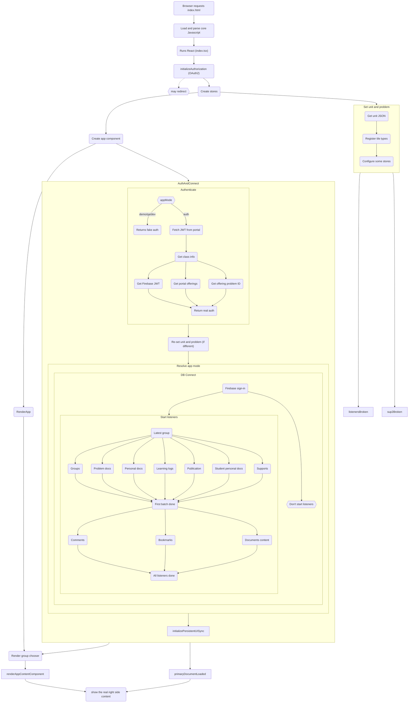

Version without Loading Event boxes:

```mermaid
flowchart TB
  req(Browser requests index.html)
  req --> parse

  parse(Load and parse core Javascript)
  parse --> indextsx

  indextsx("Runs React (index.tsx)")
  indextsx --> ia
  ia("initializeAuthorization (OAuth2)")
  restart{{may redirect}}
  ia -.-> restart
  ia --> cs
  cs(Create stores)

  component("Create app component")
  cs --> component

  cs --> sup
  subgraph sup [Set unit and problem]
    direction TB
    unit(Get unit JSON)
    unit --> tiles
    tiles(Register tile types)
    configStores(Configure some stores)
    tiles --> configStores
  end

  component --> auth
  component --> renderApp
  renderApp(RenderApp)

  subgraph auth [AuthAndConnect]
    direction TB

    subgraph authenticate [Authenticate]
      direction TB
      type{{appMode}}
      type -- demo/qa/dev --> demo
      type -- auth --> real1
      demo(Returns fake auth)
      real1(Fetch JWT from portal) --> real2(Get class info)
      real3(Get Firebase JWT)
      real4(Get portal offerings)
      real5(Get offering problem ID)
      real2 --> real3 & real4 & real5 --> real6
      real6(Return real auth)
    end

    authenticate --> sup2
    sup2("Re-set unit and problem (if different)")

    subgraph ram [Resolve app mode]
      direction TB

      subgraph db [DB Connect]
        direction TB
        fb(Firebase sign-in)
        fb --> nolisteners & listeners
        nolisteners{{Don't start listeners}}
        subgraph listeners [Start listeners]
          direction TB
          lgroup(Latest group)
          group(Groups)
          prob(Problem docs)
          pers(Personal docs)
          ll(Learning logs)
          pub(Publication)
          spd(Student personal docs)
          supl(Supports)
          lgroup --> group & prob & pers & ll & pub & spd & supl --> next
          next(First batch done)

          com(Comments)
          bm(Bookmarks)
          dc(Documents content)
          next --> com & bm & dc --> finish
          finish(All listeners done)
        end
      end
    end
    sup2 --> ram

    initializePersistentUISync
    ram --> initializePersistentUISync
  end
  sup --> listenersBroken
  sup --> sup2Broken

  renderGroupChooser(Render group chooser)
  renderApp --> renderGroupChooser
  auth --> renderGroupChooser

  renderAppContentComponent
  renderGroupChooser --> renderAppContentComponent

  primaryDocumentLoaded
  auth --> primaryDocumentLoaded

  renderDocumentWorkspaceComponentContent(show the real right side content)
  renderAppContentComponent --> renderDocumentWorkspaceComponentContent
  primaryDocumentLoaded --> renderDocumentWorkspaceComponentContent


```
