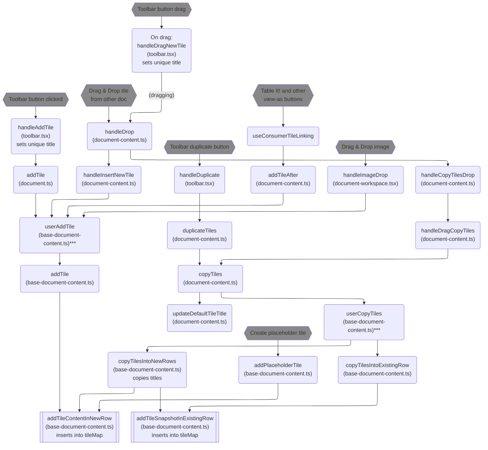

# Tile creation

How do tiles get into the document? There are several ways.

Notes:

\* Uses a tile-insertion function specified by caller as a parameter. This parameter is shown by the "(param)" link in the diagram.

\** Probably should specify userCopyTiles too, for logging

\*** Logs event
