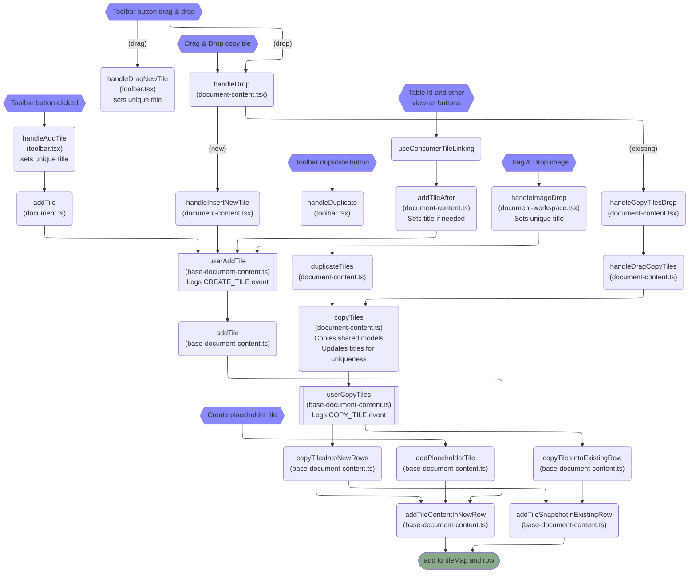

# Tile creation

How do tiles get into the document? There are several ways.

```mermaid
flowchart TD
%%{init: {"flowchart": {"defaultRenderer": "elk"}} }%%

toolbarClick{{"Toolbar button clicked"}}
TBhandleAddTile("handleAddTile\n(toolbar.tsx)\nsets unique title")
DaddTile("addTile\n(document.ts)")
BDCuserAddTile[["userAddTile\n(base-document-content.ts)\nLogs CREATE_TILE event"]]
BDCaddTile("addTile\n(base-document-content.ts)")

toolbarClick --> TBhandleAddTile --> DaddTile --> BDCuserAddTile --> BDCaddTile --> BDCaddTileContentInNewRow

toolbarDrag{{"Toolbar button drag & drop"}}
ThandleDragNewTile("handleDragNewTile\n(toolbar.tsx)\nsets unique title")
DChandleDrop("handleDrop\n(document-content.tsx)")
DChandleInsertNewTile("handleInsertNewTile\n(document-content.tsx)")

toolbarDrag -- (drag) --> ThandleDragNewTile
toolbarDrag -- (drop) --> DChandleDrop -- (new) --> DChandleInsertNewTile --> BDCuserAddTile

toolbarDuplicate{{Toolbar duplicate button}}
ThandleDuplicate("handleDuplicate\n(toolbar.tsx)")
DCduplicateTiles("duplicateTiles\n(document-content.ts)")
DCcopyTiles("copyTiles\n(document-content.ts)\nCopies shared models\nUpdates titles for uniqueness")
BDCcopyTilesIntoNewRows("copyTilesIntoNewRows\n(base-document-content.ts)")

toolbarDuplicate --> ThandleDuplicate --> DCduplicateTiles --> DCcopyTiles
BDCcopyTilesIntoNewRows --> BDCaddTileContentInNewRow

tableIt{{"Table It! and other\nview-as buttons"}}
useConsumerTileLinking("useConsumerTileLinking")
DCaddTileAfter("addTileAfter\n(document-content.ts)\nSets title if needed")

tableIt --> useConsumerTileLinking --> DCaddTileAfter --> BDCuserAddTile

placeholder{{"Create placeholder tile"}}
BDCaddPlaceholderTile("addPlaceholderTile\n(base-document-content.ts)")
placeholder --> BDCaddPlaceholderTile --> BDCaddTileContentInNewRow

dragImage{{"Drag & Drop image"}}
DWhandleImageDrop("handleImageDrop\n(document-workspace.tsx)\nSets unique title")
dragImage --> DWhandleImageDrop --> BDCuserAddTile

dragTile{{"Drag & Drop copy tile"}}
DChandleDrop("handleDrop\n(document-content.tsx)")
DChandleCopyTilesDrop("handleCopyTilesDrop\n(document-content.tsx)")
DChandleDragCopyTiles("handleDragCopyTiles\n(document-content.ts)")
BDCuserCopyTiles[["userCopyTiles\n(base-document-content.ts)\nLogs COPY_TILE event"]]
BDCcopyTilesIntoExistingRow("copyTilesIntoExistingRow\n(base-document-content.ts)")

dragTile --> DChandleDrop -- (existing) --> DChandleCopyTilesDrop --> DChandleDragCopyTiles --> DCcopyTiles --> BDCuserCopyTiles --> BDCcopyTilesIntoNewRows & BDCcopyTilesIntoExistingRow --> BDCaddTileSnapshotInExistingRow

BDCaddTileContentInNewRow("addTileContentInNewRow\n(base-document-content.ts)")
BDCaddTileSnapshotInExistingRow("addTileSnapshotInExistingRow\n(base-document-content.ts)")
insert([add to tileMap and row])

BDCaddTileContentInNewRow & BDCaddTileSnapshotInExistingRow --> insert

style insert fill:#8A8

style toolbarClick fill:#88F
style toolbarDrag fill:#88F
style toolbarDuplicate fill:#88F
style dragImage fill:#88F
style dragTile fill:#88F
style tableIt fill:#88F
style placeholder fill:#88F

```

This should display version of mermaid:
```mermaid
info
```
