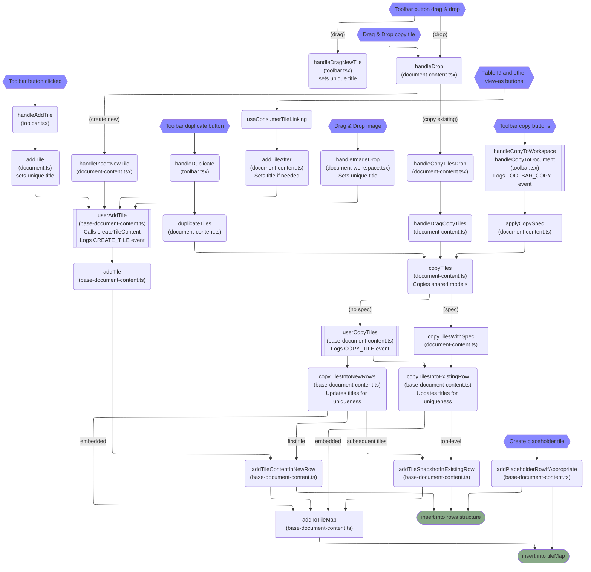

# Tile creation

How do tiles get into the document? Let me count the ways.


```mermaid
flowchart TD
%%{init: {"flowchart": {"defaultRenderer": "elk"}} }%%

toolbarClick{{"Toolbar button clicked"}}
TBhandleAddTile("handleAddTile<br/>(toolbar.tsx)")
DaddTile("addTile<br/>(document.ts)<br/>sets unique title")
BDCuserAddTile[["userAddTile<br/>(base-document-content.ts)<br/>Calls createTileContent<br/>Logs CREATE_TILE event"]]
BDCaddTile("addTile<br/>(base-document-content.ts)")

toolbarClick --> TBhandleAddTile --> DaddTile --> BDCuserAddTile

BDCuserAddTile --> BDCaddTile --> BDCaddTileContentInNewRow

toolbarDrag{{"Toolbar button drag & drop"}}
ThandleDragNewTile("handleDragNewTile<br/>(toolbar.tsx)<br/>sets unique title")
DChandleDrop("handleDrop<br/>(document-content.tsx)")
DChandleInsertNewTile("handleInsertNewTile<br/>(document-content.tsx)")

toolbarDrag -- (drag) --> ThandleDragNewTile
toolbarDrag -- (drop) --> DChandleDrop -- (create new) --> DChandleInsertNewTile --> BDCuserAddTile

toolbarDuplicate{{Toolbar duplicate button}}
ThandleDuplicate("handleDuplicate<br/>(toolbar.tsx)")
DCduplicateTiles("duplicateTiles<br/>(document-content.ts)")
DCcopyTiles("copyTiles<br/>(document-content.ts)<br/>Copies shared models")
BDCcopyTilesIntoNewRows("copyTilesIntoNewRows<br/>(base-document-content.ts)<br/>Updates titles for uniqueness")

toolbarDuplicate --> ThandleDuplicate --> DCduplicateTiles --> DCcopyTiles
BDCcopyTilesIntoNewRows --> |first tile|BDCaddTileContentInNewRow
BDCcopyTilesIntoNewRows --> |subsequent tiles| BDCaddTileSnapshotInExistingRow
BDCcopyTilesIntoNewRows --> |embedded| BDCaddToTileMap

tableIt{{"Table It! and other<br/>view-as buttons"}}
useConsumerTileLinking("useConsumerTileLinking")
DCaddTileAfter("addTileAfter<br/>(document-content.ts)<br/>Sets title if needed")

tableIt --> useConsumerTileLinking --> DCaddTileAfter --> BDCuserAddTile

placeholder{{"Create placeholder tile"}} -->
BDCaddPlaceholderRowIfAppropriate("addPlaceholderRowIfAppropriate<br/>(base-document-content.ts)")
BDCaddPlaceholderRowIfAppropriate --> insert

dragImage{{"Drag & Drop image"}}
DWhandleImageDrop("handleImageDrop<br/>(document-workspace.tsx)<br/>Sets unique title")
dragImage --> DWhandleImageDrop --> BDCuserAddTile

dragTile{{"Drag & Drop copy tile"}}
DChandleDrop("handleDrop<br/>(document-content.tsx)")
DChandleCopyTilesDrop("handleCopyTilesDrop<br/>(document-content.tsx)")
DChandleDragCopyTiles("handleDragCopyTiles<br/>(document-content.ts)")
BDCuserCopyTiles[["userCopyTiles<br/>(base-document-content.ts)<br/>Logs COPY_TILE event"]]
BDCcopyTilesIntoExistingRow("copyTilesIntoExistingRow<br/>(base-document-content.ts)<br/>Updates titles for uniqueness")
BDCcopyTilesIntoExistingRow --> |embedded| BDCaddToTileMap
BDCcopyTilesIntoExistingRow --> |top-level| BDCaddTileSnapshotInExistingRow

dragTile --> DChandleDrop -- (copy existing) --> DChandleCopyTilesDrop --> DChandleDragCopyTiles --> DCcopyTiles -- (no spec) --> BDCuserCopyTiles --> BDCcopyTilesIntoNewRows & BDCcopyTilesIntoExistingRow

toolbarCopy{{Toolbar copy buttons}} --> handleCopyTo
handleCopyTo[["handleCopyToWorkspace<br/>handleCopyToDocument<br/>(toolbar.tsx)<br/>Logs TOOLBAR_COPY... event"]] --> DCapplyCopySpec
DCapplyCopySpec["applyCopySpec<br/>(document-content.ts)"] --> DCcopyTiles
DCcopyTiles -- (spec) --> DCcopyTilesWithSpec
DCcopyTilesWithSpec["copyTilesWithSpec<br/>(document-content.ts)"] --> BDCcopyTilesIntoExistingRow

BDCaddTileContentInNewRow("addTileContentInNewRow<br/>(base-document-content.ts)")
BDCaddTileSnapshotInExistingRow("addTileSnapshotInExistingRow<br/>(base-document-content.ts)")

BDCaddToTileMap["addToTileMap<br/>(base-document-content.ts)"] --> insert

BDCaddTileContentInNewRow & BDCaddTileSnapshotInExistingRow --> BDCaddToTileMap
BDCaddTileContentInNewRow & BDCaddTileSnapshotInExistingRow & BDCaddPlaceholderRowIfAppropriate --> rowinsert

insert([insert into tileMap])
rowinsert([insert into rows structure])

style insert fill:#8A8
style rowinsert fill:#8A8

style toolbarClick fill:#88F
style toolbarDrag fill:#88F
style toolbarDuplicate fill:#88F
style dragImage fill:#88F
style dragTile fill:#88F
style tableIt fill:#88F
style toolbarCopy fill:#88F
style placeholder fill:#88F

```

<!-- This should display version of mermaid:
```mermaid
info
``` -->
