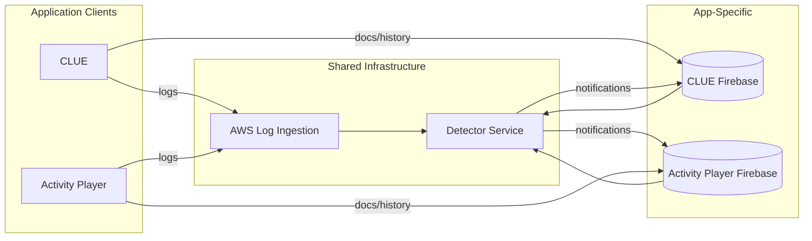
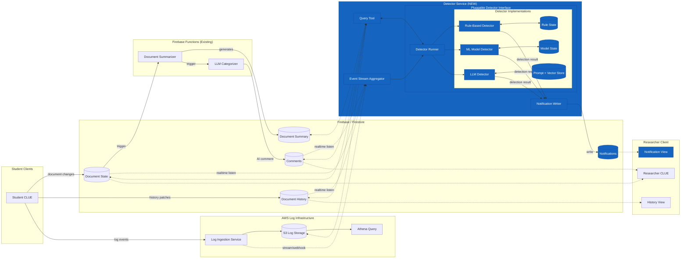

# Detector-Driven Notifications

## Overview

This spec describes a system to notify researchers in real-time when students perform "interesting" actions during a class period, enabling timely interviews while events are fresh in students' memory.

## Scope

This spec focuses on the CLUE implementation. While the architecture is designed with cross-project reusability in mind (see Cross-Project Reusability below), detailed requirements and answers to open questions are specific to CLUE. Activity Player adaptation will be addressed in a separate document.

## Related Documents

- [Detector Authoring](detector-authoring.md) - How researchers build detectors (workflow, labeling, type progression)
- [Rule-Based Detector](detector-rule-based.md) - Pattern matching, counts, sequences
- [ML Model Detector](detector-ml-model.md) - Trained classifiers on historical data
- [LLM Detector](detector-llm.md) - Prompted detection with semantic memory

## Cross-Project Reusability

The detector service is designed to work with multiple applications:



The detector service might use **adapters** to normalize data from different Firebase project structures while sharing the same log event infrastructure. However it might be fine if each detector implementation is specific to the AP or CLUE. Even being specific to AP or CLUE it is likely the implementations will share common code for working with the log data and saving their state so they don't need to reparse the whole stream of data on each new event.

## Data Flow Summary

1. **Ingestion**: Student actions generate document changes (Firebase/Firestore), history entries (Firestore), and log events (AWS)
2. **Aggregation**: Event Stream Aggregator combines real-time feeds into unified stream
3. **Detection**: Detector Runner invokes configured detector with new events + memory
4. **Query**: Detector can query full document state, history, or logs as needed
5. **Notification**: Detection results written to Firestore notifications collection
6. **Display**: CLUE or AP client receives real-time notification updates

## CLUE System Architecture Diagram

The following diagram is specific to CLUE, however many parts overlap with AP.



## Component Descriptions

### Existing Components

| Component | Description |
|-----------|-------------|
| **Student CLUE Clients** | Multiple students creating/editing documents, generating log events |
| **Firebase/Firestore** | Stores document state, change history, and comments |
| **AWS Log Infrastructure** | Ingests log events, stores to S3, queryable via Athena |
| **Firebase Functions** | Generate document summaries and LLM-based categorization comments |
| **Researcher CLUE** | Views class documents with history scrubbing capability |

### New Components

| Component | Description |
|-----------|-------------|
| **Event Stream Aggregator** | Combines real-time feeds from document state, document history, comments, and log events into a unified stream |
| **Query Tool** | An MCP tool for LLM-based detectors to fetch additional context on demand (e.g., document state, history, other students' work). Rule-based and ML detectors typically build up document state incrementally from history entries rather than querying. |
| **Detector Memory Stores** | Each detector maintains its own memory: rule-based detectors save serialized state, ML models save model state, LLM detectors save text prompts and vector stores for recall |
| **Detector Runner** | Orchestrates detection by feeding new events + memory to the configured detector implementation |
| **Pluggable Detector Implementations** | Rule-based, ML, or LLM detectors that share a common interface |
| **Notification Writer** | Writes detection results to Firestore for researcher clients to receive |
| **Notifications Collection** | Firestore collection that researcher clients listen to for real-time alerts |
| **Notification View** | UI component in researcher's CLUE showing detection alerts |

## Pluggable Detector Interface

All detector implementations share a common interface. The following interface is for illustration purposes. It is likely we will not make abstractions for all the services a detector needs, the detector can just get access to the service directly. For example the "memory" might just be a database in some cases.

```
interface DetectorInput {
  newEvents: Event[]           // New log events since last run
  newHistoryEntries: Entries[]   // New document history since last run
  memory: DetectorMemory       // Accumulated state from previous runs

  // Query functions for on-demand access
  queryDocument(docId): DocumentState
  queryHistory(docId, timeRange): HistoryEntry[]
  queryLogs(filters): LogEvent[]
  querySummary(docId): MarkdownSummary
}

interface DetectorOutput {
  notifications: Notification[]  // Any detected interesting events
  updatedMemory: DetectorMemory  // Updated state to persist
}
```

### Detector Types

The system supports multiple detector types. See the individual specs for implementation details.

| Type | Example Use Case | Spec |
|------|------------------|------|
| **Rule-Based** | "Alert when student deletes more than 3 objects in 1 minute" | [detector-rule-based.md](detector-rule-based.md) |
| **ML Model** | "Detect struggling students based on interaction patterns" | [detector-ml-model.md](detector-ml-model.md) |
| **LLM** | "Find moments of insight or confusion" | [detector-llm.md](detector-llm.md) |

## Event Aggregator

*Details to be added.* The Event Stream Aggregator combines real-time feeds from multiple sources into a unified stream for detectors.

Key topics to address:
- Integration with Firebase realtime listeners (document state, history, comments)
- Integration with AWS log ingestion (stream/webhook options)
- Event normalization and ordering strategy
- Routing events to appropriate detector instances

## Questions

### Infrastructure & Architecture

Q: Should the Detector Service run as Firebase Functions, a separate cloud service, or a hybrid?
A: It will probably be different for different types of detectors. In some cases running the detector as a microVM in AWS will likely be better. These might allow us to easily save state (memory) without needing a database, and would not be too expensive. It is probably the "memory" feature of each detector that will determine where it should run. A ML model is likely to require a large initial "load" so running it as lambda or firebase function would be out of the question.

For rule-based detectors, recommendations are **Bytewax (Python)** for fastest path with built-in state management, or **TypeScript+RxJS** if browser-based rule authoring is important. See [Rule-Based Detector: Rule Engine Options](detector-rule-based.md#rule-engine-options) for full comparison.

Q: How does the detector service scale?
A: Hybrid approach—shared event aggregation with separate detector instances.

Considerations:
- A single microVM may not handle 30 students generating events. Students could be sharded across multiple microVMs, with one microVM handling multiple students.
- Class-wide event detection should still be supported. If a class-wide detector can't handle the volume, a tiered approach may be needed.
- Ideally, tiering is handled internally by the detector implementation. The main system just provides events; if a detector needs multiple instances, it manages that internally.

Q: How are events delivered to detectors?
A: Open question. Two models:
1. **Push model**: System sends events to detector without backpressure handling. Detector manages its own queuing if it falls behind.
2. **Pull model**: System provides a queue (per detector or per class). Detector reads from the queue at its own pace.

The pull model is more robust but adds infrastructure. The push model is simpler but risks overwhelming slow detectors.

### Data & Events

Q: How should log events be streamed to the Detector Service in real-time?
A: Options include: (1) Add Firestore write in addition to S3 during ingestion, (2) Kinesis/SQS stream from AWS ingestion, (3) Webhook from ingestion service. Need to understand current ingestion architecture to determine best approach.

Q: What is the structure/schema of the log events?
A: Log events include:
- **Extras** (context on every event): username, role, group, classHash, investigation, problem, section, UI state, session, time
- **Parameters** (event-specific): documentKey, documentUid, objectType, targetId, operation, text, wordCount, etc.

See [Rule-Based Detector: Data Sources](detector-rule-based.md#data-sources) for full details and links to CSV documentation (~85 event types).

Q: How are events from different sources ordered?
A: Events come from multiple sources (log events, history entries, comments) with different timing characteristics:
- Log events and history entries have timestamps and document revision IDs
- Comments have document revision IDs but may be seen by students after further document changes

Initial approach: Send events to detectors as they arrive; let each detector handle ordering as needed. After building a few detectors, common ordering patterns may emerge that can be extracted into the outer system.

Q: Which detector types use the Query Tool?
A: Primarily LLM-based detectors. The Query Tool is an MCP tool that allows LLM detectors to search for additional context when needed (e.g., "what did other students do?", "what's the current document state?").

Rule-based and ML detectors typically don't need on-demand queries—they build up document state incrementally from history entries as events arrive. Querying for document state on each event would be inefficient compared to maintaining state internally.

### Operations

Q: What are the latency requirements for notifications?
A: Target ~30 seconds from student action to researcher notification, based on the research paper this work builds on. This is not a hard requirement, just an initial target.

Q: Can multiple detectors run simultaneously on the same class?
A: Yes. Multiple detectors can run in parallel. Duplicate notifications from different detectors are acceptable—each notification will include the name of the detector that generated it, so researchers can distinguish the source.

Q: How should detectors handle recovery and multi-session activities?
A: Best effort is acceptable for v1. Activities can span multiple days, so detectors need either:
1. **Replay on startup**: Replay previous events before processing new ones
2. **Persistent memory**: Checkpoint state between sessions

For rule-based detectors, the choice of stream processing framework affects this significantly—see [Rule-Based Detector: State Management](detector-rule-based.md#state-management) for comparison of Bytewax (automatic recovery) vs. TypeScript+RxJS (custom checkpointing).

Q: How will detectors be tested and validated?
A: Testing is important even for v1—classroom observations are infrequent, so a detector that fails to catch anything is an expensive mistake.

Two approaches needed:
1. **Historical replay**: During development, run existing class data through the detector to verify it catches expected events. If historical data doesn't exist or is insufficient, the detector author should generate test data.
2. **Demo class mode**: Researchers and other users can try to trigger the detector in a demo class. The same user can act as both student and researcher (e.g., two CLUE windows—one as student, one as researcher) to see notifications in real-time when the detector fires.

Q: What are the cost implications of different detector types?
A: Not yet analyzed. Key cost factors to consider:
- **LLM detectors**: API costs per inference (tokens in/out), frequency of evaluation triggers
- **ML detectors**: Compute costs for persistent runtime (microVM), training costs for model updates
- **Rule-based detectors**: Likely lowest cost, but infrastructure for state management
- **Shared infrastructure**: Event aggregation, Firestore reads/writes for notifications

Need to estimate costs for a typical deployment (e.g., 5 classes × 30 students × 1 hour session) across detector types before committing to architecture decisions.

### Questions for Product Owner (Leslie)

Q: What is the notification lifecycle?
A: To be discussed. Options include: dismiss/acknowledge, mark as "interviewed", snooze, auto-expiration (e.g., end of class), attach notes. Initial implementation will be minimal.

Q: How are detectors configured and deployed?
A: To be discussed. Context: The portal has resources assigned to classes, with teachers organized into cohorts for researcher projects. Detectors will likely be resource-specific.

Ideal flow (may be overkill for v1):
- Researcher selects a detector and optionally configures it
- Detector is associated with a resource in the portal
- When researcher opens CLUE for that resource/class, they can start one or more configured detectors
- Detectors auto-stop after researcher closes CLUE (e.g., 1 hour timeout)

Simpler v1 alternative: Developer uses UI or CLI to manually start a detector configured for a specific resource and class (or set of classes).
