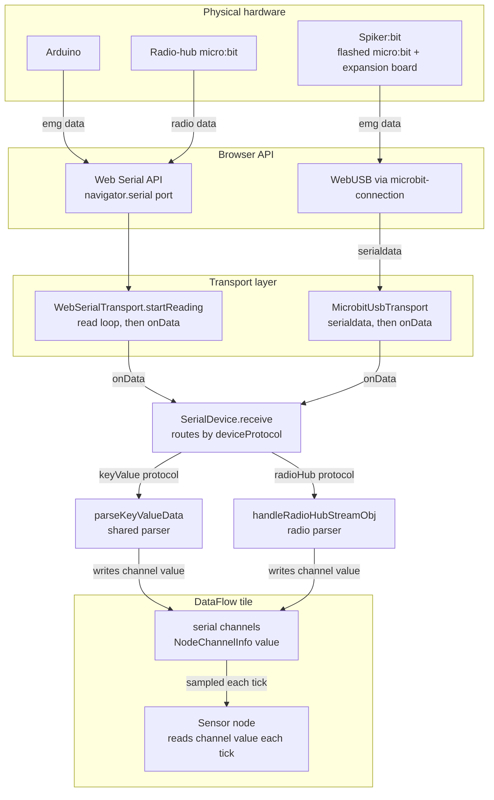
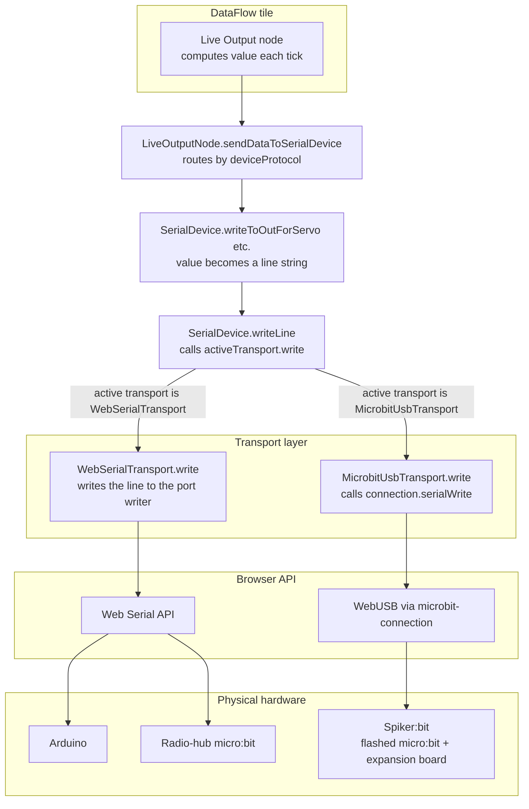

# Serial connections to DataFlow

How serial data moves between physical hardware and DataFlow tile nodes, for the two
current hardware paths:

- **Arduino** (and the radio-hub micro:bit) over the **Web Serial API**.
- **Spiker:bit** (a micro:bit expansion board) over **WebUSB**, via
  `@microbit/microbit-connection`.

Two directions are covered: **inbound** (bytes arriving at the computer → a Sensor node)
and **outbound** (a Live Output node → bytes leaving the computer).

> The diagrams below are shown as pre-rendered SVGs (so they display in any Markdown
> viewer); the editable Mermaid source for each is kept in a collapsed **Mermaid source**
> block underneath. If you edit the Mermaid, re-export the matching SVG into
> `images/` (from the repo root):
>
> ```
> PUPPETEER_EXECUTABLE_PATH="/Applications/Google Chrome.app/Contents/MacOS/Google Chrome" \
>   npx -y @mermaid-js/mermaid-cli \
>   -i src/plugins/dataflow-tool/serial.md \
>   -o src/plugins/dataflow-tool/images/dataflow-hardware.svg
> ```
>
> It writes one SVG per Mermaid block in document order (`…-1.svg` = inbound,
> `…-2.svg` = outbound); rename them to match the `![…]` references below.

## The objects

| Object | File | Role |
|---|---|---|
| `WebSerialTransport` | `src/models/stores/web-serial-transport.ts` | Owns the Web Serial port + read loop; `write()` out, `onData` in. |
| `MicrobitUsbTransport` | `src/models/stores/spikerbit-device.ts` | `IDeviceTransport` over a micro:bit WebUSB connection: `write()` out, `serialdata` → `onData` in, `status` → `onDisconnect`. |
| `SpikerbitDevice` | `src/models/stores/spikerbit-device.ts` | Spiker:bit connect/version/flash state machine; taps `onData` for connect-time version detection, then hands the transport to the store. |
| `SerialDevice` | `src/models/stores/serial.ts` | Transport-agnostic connection store: holds the active transport + channels, routes writes (`writeLine`) and inbound parsing (`receive`). |
| `parseKeyValueData` | `src/models/stores/serial-protocol.ts` | Shared parser: `emg:<n>\r\n` lines → channel values. |
| tile serial channels | `NodeChannelInfo[]` (`.../model/utilities/channel.ts`) | The shared blackboard: parsers write `channel.value`; the Sensor node reads it. |
| `SensorNode` / `LiveOutputNode` | `.../nodes/sensor-node.ts`, `live-output-node.ts` | DataFlow nodes that read inbound values / emit outbound values each tick. |

`IDeviceTransport` (`src/models/stores/device-transport.ts`) is the shared contract:
`write(line)`, `close()`, and optional `onData(chunk)` / `onDisconnect()`.

Device **identity** (`SerialDevice.deviceFamily`: `arduino` / `microbit` / `spikerbit`)
is distinct from a channel's **protocol** tag (`channel.protocol`: `keyValue` /
`radioHub`). `kDeviceCapabilities` (`.../model/utilities/device-capabilities.ts`) maps
identity → `{ protocol, displayName, outputs }`, so the same wire protocol can be spoken
by more than one device (the Arduino and the Spiker:bit both speak `keyValue`).

## Connecting a device

The DataFlow toolbar's connect affordance chooses a flow by device type: a Web Serial
board (`serialDeviceRefresh`) or the Spiker:bit (`connectSpikerbit`). Both end by calling
`SerialDevice.setActiveDevice(deviceFamily, transport, channels)`, which records the active
transport, wires its inbound callbacks, and marks the store connected.

**Web Serial (`serialDeviceRefresh` in `dataflow-program.tsx`):**

1. `new WebSerialTransport()`, then `transport.open()`:
   `navigator.serial.requestPort()` shows the browser's device chooser; on selection we
   read `getInfo()`, resolve `deviceFamily`, and open the port at 9600 baud.
2. `setActiveDevice(transport.deviceFamily, transport, channels)` and
   `setKnownBoard(transport.knownBoard)`.
3. `transport.startReading()` starts the inbound read loop.

The device chooser is intentionally **unfiltered**. `requestPort()` could take USB-ID
filters so only Arduino-like boards appear, but working Arduino clones do not all match a
clean filter — one is shipped with the latest generation of Backyard Brains hardware — so
filtering would hide boards that actually work. Rather than chase every non-standard
board's IDs, we show everything and rely on `deviceFamily` resolution afterward. (A future
improvement would be to import an updatable, comprehensive board list and build filters
from it.)

**Device identity** is resolved from the USB descriptor in
`WebSerialTransport.determineDeviceFamily`: a micro:bit reports `usbProductId === 516 &&
usbVendorId === 3368`; anything else is assumed to be an Arduino. `knownBoard` (an
authentic Arduino, `usbProductId === 67`) additionally drives connect-button UI, because
only authentic Arduinos raise the browser `connect` event.

**Spiker:bit (`connectSpikerbit`):** constructs a `SpikerbitDevice` and calls
`connectAndStream`, which connects over WebUSB, checks and if needed flashes the firmware
(see [Spiker:bit version check and flashing](#spikerbit-version-check-and-flashing) below),
then calls `setActiveDevice("spikerbit", transport, channels)`.

## Spiker:bit version check and flashing

The Spiker:bit runs a fixed micro:bit program (`CLUE-SPIKERBIT v<N>`, bundled at
`src/plugins/dataflow/firmware/spikerbit-clue.hex`). Before handing the transport to the
store, `SpikerbitDevice.connectAndStream` makes sure the board is running a current build:

1. It points the transport's `onData` at a connect-time handler (`handleVersionData`) that
   scans inbound data for the version banner using `detectSpikerbitVersion`, recording the
   reported version.
2. `queryVersion` writes `?` and waits up to ~1.5s (`kVersionQueryTimeoutMs`) for that
   banner to arrive.
3. If no banner arrives (no known firmware) or the reported version is older than
   `kSpikerbitFirmwareVersion`, it flashes the bundled hex (a partial flash, reporting
   progress) and queries again. The USB connection stays Connected across the flash — the
   DAPLink interface chip is untouched and serial auto-reinitialises — so no explicit
   reconnect is needed.
4. It then calls `setActiveDevice("spikerbit", transport, channels)`, which repoints
   `onData` from version detection to `SerialDevice.receive` and begins EMG streaming.

Bump `kSpikerbitFirmwareVersion` together with the `VERSION` constant in the MakeCode
source whenever the firmware changes; see
[the firmware README](../dataflow/firmware/README.md) for how to rebuild the hex.

## Inbound: hardware → Sensor node



<details>
<summary>Mermaid source</summary>



</details>

Walkthrough:

- **Arduino (Web Serial):** the physical device emits `emg:<n>\r\n`. `WebSerialTransport`'s
  read loop decodes each chunk and calls `onData`, which `SerialDevice.setActiveDevice`
  wired to `SerialDevice.receive`. `receive` looks up the device's protocol in the
  capability map and dispatches to `handleKeyValueStreamObj` → `parseKeyValueData`,
  which writes `channel.value` on the matching channel.
- **Spiker:bit (WebUSB):** `MicrobitUsbTransport` owns the connection's `serialdata` event
  and forwards each chunk to `onData`, which `SerialDevice.setActiveDevice` wired to
  `SerialDevice.receive` — exactly like the Web Serial path. The Spiker:bit's `deviceFamily`
  maps to the `keyValue` protocol, so `receive` dispatches to the same
  `handleKeyValueStreamObj` → `parseKeyValueData`. During connect (before
  `setActiveDevice`), `SpikerbitDevice` temporarily points `onData` at a version-detection
  handler to decide whether to flash; EMG parsing begins once the transport becomes the
  active device.
- **Into the node:** both paths mutate the same `NodeChannelInfo` objects (the tile's
  `channels`). Each tick the Rete manager samples them and the `Sensor node`'s `data()`
  reads `getChannels().find(...).value`.

> **micro:bit vs. Spiker:bit.** Both are physically micro:bits, but they connect
> differently. A **radio-hub micro:bit** connects over **Web Serial** (same transport as
> the Arduino); `receive` routes its data to `handleRadioHubStreamObj` — a different parser
> — because its `deviceFamily` maps to the `radioHub` protocol. The **Spiker:bit** is a
> micro:bit running the flashed CLUE-SPIKERBIT program on an expansion board; it connects
> over **WebUSB** so it can be flashed and read via `@microbit/microbit-connection`.

### Reconstituting messages from the stream

The read loop hands each parser a raw string chunk decoded from the port. A chunk is a
malformed representation of any number of whole or partial serial messages, chomped off
the stream at unpredictable spots that do not respect the original message boundaries. So
the parser cannot assume a chunk is one clean line. Each parser (`parseKeyValueData`,
`handleRadioHubStreamObj`) therefore appends the chunk to a **local buffer**, then scans
the buffer for a complete, legitimate value using a regular expression closely paired to
the devices and the sensors/actuators DataFlow supports. On a match it parses out the
value plus an indicator of which channel the value belongs to, finds that channel, and
sets the value on it — leaving any trailing partial line in the buffer for the next chunk.

## Outbound: Live Output node → hardware



<details>
<summary>Mermaid source</summary>



</details>

Walkthrough:

- Each tick, the `Live Output node`'s `data()` calls `sendDataToSerialDevice`, which reads
  `serialDevice.deviceFamily`, resolves its protocol via the capability map, and calls the
  matching `SerialDevice.writeToOut…` formatter (e.g. servo-angle scaling).
- The formatter produces a line string and calls `SerialDevice.writeLine(line)`, which is
  the **single unified exit**: `this.activeTransport.write(line)`.
- Only the concrete transport differs: `WebSerialTransport.write` frames the line and
  writes it to the Web Serial port's writer; `MicrobitUsbTransport.write` calls
  `connection.serialWrite`. Neither the node nor `SerialDevice` above `writeLine` knows or
  cares which transport is active.

## Connection status tracking

Beyond the active transport, `SerialDevice` keeps bookkeeping the UI reads to reflect
connection state: `connectChangeStamp`/`lastConnectMessage` (the last time and reason the
status changed, updated via `updateConnectionInfo`), `serialModalShown` (so the connect
modal isn't shown repeatedly), and `serialNodesCount` (how many nodes currently need a
serial connection).

The browser's own `navigator.serial` `connect`/`disconnect` events are wired once at store
creation by `initWebSerialConnectionEvents` (`web-serial-transport.ts`), keeping
`navigator.serial` out of `SerialDevice`. Authentic Arduinos raise `connect` before the
user clicks, so this affordance can note a board is present. The `disconnect` handler only
tears down the store when a `WebSerialTransport` currently owns the connection, so an
unrelated Web Serial disconnect cannot kill a live WebUSB (Spiker:bit) session.

## Summary

Both directions run through `SerialDevice` and are transport-agnostic: outbound via
`writeLine → activeTransport.write`, inbound via `transport.onData → SerialDevice.receive`.
The active transport is swapped in at connect through `setActiveDevice`.
